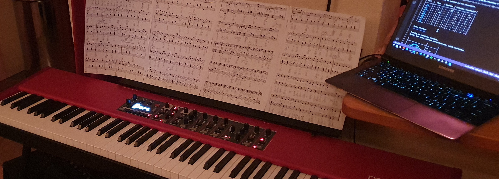

Introduction
============

*JJ van Zon, 2022*

Piano playing is a hobby of mine. Here I try to organize my thoughts about it. And share documents I may make.

I may have difficulty reading notes, memorizing pieces, finding a good technique and motor control.  
I have some thoughts about how playing might be made more expressive.  

I try to support these goals with the content found here.  

Contents
========

- ### [Goals 🎯](goals.md)
    - Some goals I might have with my piano playing hobby.
- ### [Short-Term Goals 🏹](short-term-goals.md)
    - Short term goals / preparation for the next performance.
- ### [Pieces to Play 🎶](pieces-to-play.md)
    - A list of pieces I play / have played / would like to play.
- ### [Recordings 🔊](recordings.md)
    - Recordings of my playing some piano pieces.
- ### Individual pieces: 🏛
    - Recordings, notes and analyses of individual piano pieces.
    - [Erik Satie - Gnossienne Ⅰ](satie-gnossienne-1/README.md)
    - [Erik Satie - Gymnopédie Ⅰ](satie-gymnopedie-1/README.md)
    - [Frédéric Chopin - Mazurka Op. 24, No. 2](chopin-mazurka-op-24-no-2/README.md)
    - [Claude Debussy - Arabesque Ⅰ](debussy-arabesque-1/README.md)
    - [Mozart - Sonata Facile KV 545 Part 1](mozart-sonata-facile-part-1/README.md)
    - [Frédéric Chopin - Ballade Ⅱ](chopin-ballade-2/README.md)
- ### [Methods ⚙](methods/README.md)
    - You may find some of my methods of working here.
- ### [Links 🌐](links.md)
    - Links to possibly useful information.
- ### [Nord Piano 4 🎹](nord-piano-4/README.md)
    - Lists some of my favorite sounds for my Nord Piano 4 digital piano. Also has planning notes about how I worked on selecting them.
- ### [Resources 🔧](resources/README.md)
    - Pictures and also characters and symbols that might be a helpful aid for music notes and analyses.
- ### [TODO ✅](todo.md)
    - Some rough plans about what I might like to do next.
- ### [Archive 🗃](archive/README.md)
    - Older but somehow difficult to delete content.