Piano Playing Docs | Methods
============================

*JJ van Zon, 2021*

Piano Motion Symbols | Archive
------------------------------

Symbols currently out of favor.

|                                                                                              |                                                           |
|:--------------------------------------------------------------------------------------------:|-----------------------------------------------------------|
| 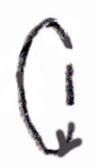               | Turn forward
| 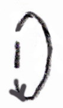               | Turn forward
|                      | Turn forward
| 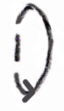                    | Turn forward
| 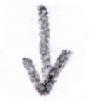                                      | Gravity assist                                            |
| 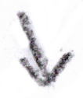                                 | Gravity assist (left)                                     |
| 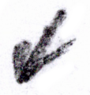                                | Gravity assist (right)                                    |
| 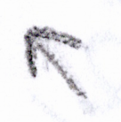                                    | Hand upward (left)                                        |
|                                    | Hand upward (right)                                       |
| 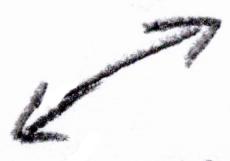                                  | Stretch diagonally                                        |
| 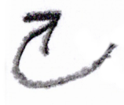  | Cross over / wrist turn (thumb under finger / left hand)  |
| 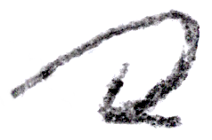   | Cross over / wrist turn (finger over thumb / left hand)   |
| 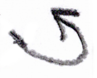 | Cross over / wrist turn (thumb under finger / right hand) |
| 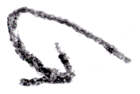  | Cross over / wrist turn (finger over thumb / right hand)  |
| 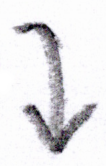                                 | Bowy jump sideways                                        |
| 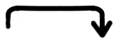                                      | Controlled jump                                           |
| 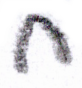                                         | Wrist pivot                                               |
| 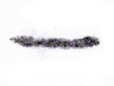                                       | Switch finger                                             |
| 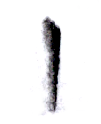                                     | 1 finger (pronounced)                                     |
| 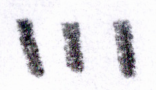                                           | 3 fingers                                                 |
| 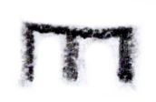                                | 3 fingers (pronounced)                                    |
| 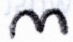                                  | 3 fingers (curved / variation 1)                          |
| 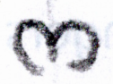                                  | 3 fingers (curved / variation 2)                          |
| 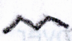                                      | 3 fingers flat                                            |
| 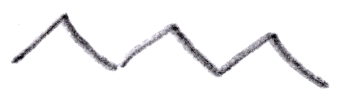                                      | 4 fingers flat                                            |
| 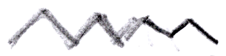                                      | 5 fingers flat                                            |
| 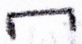                                             | Wrist                                                     |
|                                              | Wrist (alternative)                                       |
| 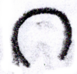                                          | Wrist high                                                |
| 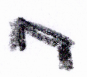                                        | Wrist tilted                                              |
|                               | Switch finger (in place)                                  |
| 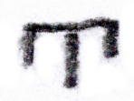      | 3 fingers (pronounced / mid finger deeper in keys)        |
| 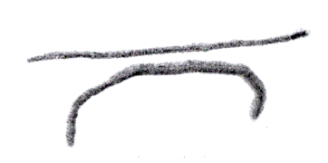                                 | Curved wrist stationary                                   |
| 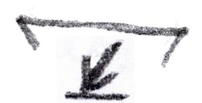                                | Pronounced wrist pressed                                  |
| 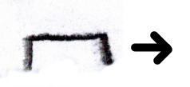                                    | Wrist move (right)                                        |
| 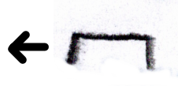                                     | Wrist move (left)                                         |
| 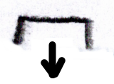                       | Wrist move (towards white keys)                           |
| 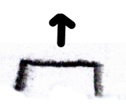                       | Wrist move (towards black keys)                           |
| 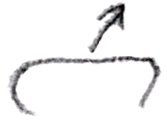                     | Wrist move (towards face / variation 2)               |
| 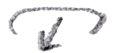                   | Wrist move (away from face / variation 2)             | 
| 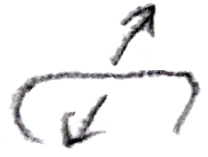       | Wrist move (towards and away from face / variation 2) |
| 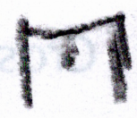   | 3 fingers (pronounced / outer fingers deeper in keys)     |
| 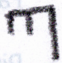    | 3 fingers (pronounced / right finger deeper in keys)      |
| 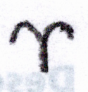          | 3 fingers (curved / mid finger deeper in keys / variation 1)    |
| 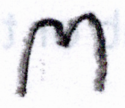       | 3 fingers (curved / outer finger deeper in keys / variation 1)  |
| 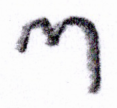        | 3 fingers (curved / right finger deeper in keys / variation 1)  |
| 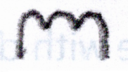       | 4 fingers (curved / outer fingers deeper in keys / variation 1) |

*Forearm 2D-diagonals:*

These seemed less practical:

| |   | |   |
|-|:-:|-|:-:|
| Forearm position (up-outward) |  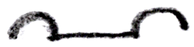 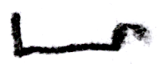 | Forearm position (down-outward) |    |
| Forearm position (up-inward) | 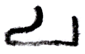  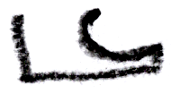 | Forearm position (down-inward) | 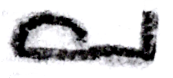   |

*Forearm backward:*

| |   | |   |
|-|:-:|-|:-:|
| Forearm position backward | 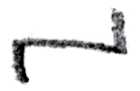 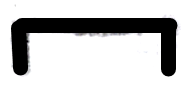  | | |
| Forearm position (backward-outward) |    | Forearm position (backward-inward) |    |
| Forearm position (backward-down) |    | Forearm position (backward-up) |    |
| Forearm position (backward-down-outward) |    | Forearm position (backward-down-inward) |    |
| Forearm position (backward-up-outward) |    | Forearm position (backward-up-inward) |    |
