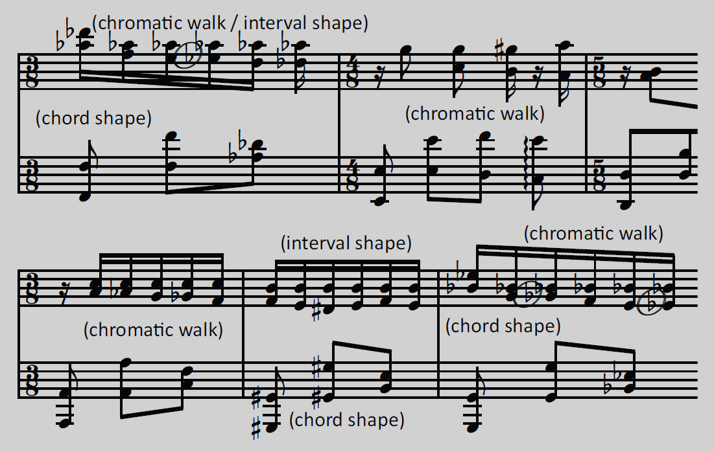

♯♭ Frédéric Chopin - Ballade Ⅱ
===============================

`[ Draft ]`

[back](../README.md)

Sheet Music with Accidental Reasons
-----------------------------------

### Introduction

Variation of simplified sheet music, with *reasons* for b or #. See [b and # reasons](https://jjvanzon.github.io/Piano-Playing-Docs/methods/sheet-music-simplification.html#b-and--reasons).

### Preview

### Contents

- [Sheet Music with Accidental Reasons (PDF)](chopin-ballade-2-sheet-music-with-accidental-reasons.pdf) `[ Draft ]`
- [Sheet Music with Accidental Reasons (MuseScore Uncompressed XML File)](chopin-ballade-2-sheet-music-with-accidental-reasons.mscx) `[ Draft ]`

### Original

Derived from [this](https://jjvanzon.github.io/Piano-Playing-Docs/chopin-ballade-2/sheet-music/README.html) version.

[back](../README.md)
