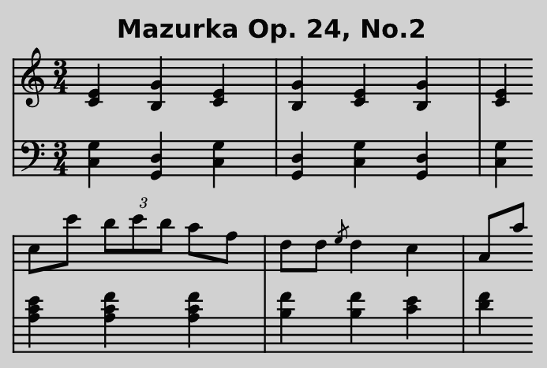

🎵 Frédéric Chopin - Mazurka Op. 24, No. 2
===========================================

*JJ van Zon, 2022*

[back](../README.md)

Sheet Music with Simplified Notation
------------------------------------

### Introduction

Visually simpler. Accidentals always placed near notes, even when part of the key. Organized in a more regular pattern of 4 bars per line. Fragments / phrases are separated by double bar lines.  
Simplified using the following [guidelines](https://jjvanzon.github.io/Piano-Playing-Docs/methods/sheet-music-simplification.html).

### Preview

### Contents

- [Sheet Music with Simplified Notation (PDF)](chopin-mazurka-op-24-no-2-sheet-music-simplified-notation.pdf)
- <a href="https://musescore.com/user/42589871/scores/7733957" target="_blank" rel="noopener noreferrer">Sheet Music with Simplified Notation (MuseScore Web Page)</a>
- [Sheet Music with Simplified Notation(MuseScore File)](chopin-mazurka-op-24-no-2-sheet-music-simplified-notation.mscz)
- [Sheet Music with Simplified Notation(MuseScore Uncompressed XML File)](chopin-mazurka-op-24-no-2-sheet-music-simplified-notation.mscx)

### Original

Derived from [this](https://jjvanzon.github.io/Piano-Playing-Docs/chopin-mazurka-op-24-no-2/sheet-music/README.html) version.

[back](../README.md)