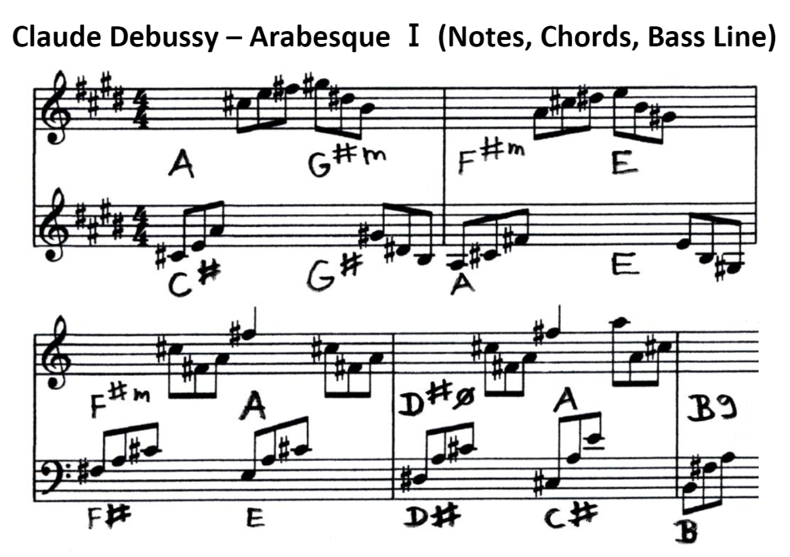

Claude Debussy - Arabesque Ⅰ
============================

*JJ van Zon, 2022*

[back](../README.md)

Notes, Chords & Bass Line
-------------------------

### Introduction

Visually simpler notes with chords and bass line. Accidentals always placed near notes, even when part of the key. 

### Preview

### Contents

- [Claude Debussy Arabesque Ⅰ Notes, Chords, Bass Line (PDF)](debussy-arabesque-1-notes-chords-bass-line.pdf)
- [Claude Debussy Arabesque Ⅰ Notes, Chords, Bass Line (docx)](debussy-arabesque-1-notes-chords-bass-line.docx)
- [Claude Debussy Arabesque Ⅰ Notes, Chords, Bass Line Page 1 (png)](debussy-arabesque-1-notes-chords-bass-line-page-1.png)
- [Claude Debussy Arabesque Ⅰ Notes, Chords, Bass Line Page 2 (png)](debussy-arabesque-1-notes-chords-bass-line-page-2.png)
- [Claude Debussy Arabesque Ⅰ Notes, Chords, Bass Line Page 3 (png)](debussy-arabesque-1-notes-chords-bass-line-page-3.png)
- [Claude Debussy Arabesque Ⅰ Notes, Chords, Bass Line Page 4 (png)](debussy-arabesque-1-notes-chords-bass-line-page-4.png)
- [Claude Debussy Arabesque Ⅰ Notes, Chords, Bass Line Page 5 (png)](debussy-arabesque-1-notes-chords-bass-line-page-5.png)
- [Claude Debussy Arabesque Ⅰ Notes, Chords, Bass Line Preview](debussy-arabesque-1-notes-chords-bass-line-preview.png)
- [Claude Debussy Arabesque Ⅰ Notes, Chords, Bass Line Preview (Darker)](debussy-arabesque-1-notes-chords-bass-line-preview-darker.png)

### Original

Originally derived from:  
<a href="https://michaelkravchuk.com/free-piano-sheet-music-first-arabesque-debussy/" target="_blank">Michael Kravchuk - Free Piano Sheet Music – First Arabesque – Debussy</a>

[back](../README.md)