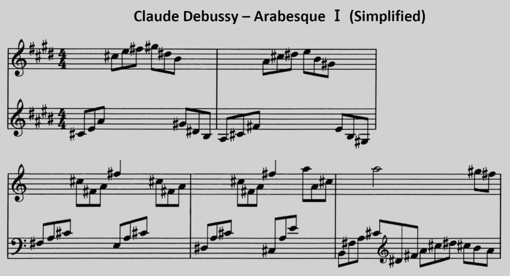

🎵 Claude Debussy - Arabesque Ⅰ
===============================

*JJ van Zon, 2022*

[back](../README.md)

Sheet Music with Simplified Notation
------------------------------------

### Introduction

Visually simpler. Accidentals always placed near notes, even when part of the key.  
Simplified using the following [guidelines](https://jjvanzon.github.io/Piano-Playing-Docs/methods/sheet-music-simplification.html).

### Preview

### Contents

- [Sheet Music with Simplified Notation (PDF)](debussy-arabesque-1-sheet-music-simplified-notation.pdf)
- [Sheet Music with Simplified Notation (docx)](debussy-arabesque-1-sheet-music-simplified-notation.docx)
- [Sheet Music with Simplified Notation Page 1 (png)](debussy-arabesque-1-sheet-music-simplified-notation-page-1.png)
- [Sheet Music with Simplified Notation Page 2 (png)](debussy-arabesque-1-sheet-music-simplified-notation-page-2.png)
- [Sheet Music with Simplified Notation Page 3 (png)](debussy-arabesque-1-sheet-music-simplified-notation-page-3.png)
- [Sheet Music with Simplified Notation Page 4 (png)](debussy-arabesque-1-sheet-music-simplified-notation-page-4.png)
- [Sheet Music with Simplified Notation Page 5 (png)](debussy-arabesque-1-sheet-music-simplified-notation-page-5.png)
- [Sheet Music with Simplified Notation Preview](debussy-arabesque-1-sheet-music-simplified-notation-preview.jpg)

### Original

Derived from:  
<a href="https://michaelkravchuk.com/free-piano-sheet-music-first-arabesque-debussy/" target="_blank">Michael Kravchuk - Free Piano Sheet Music – First Arabesque – Debussy</a>

[back](../README.md)