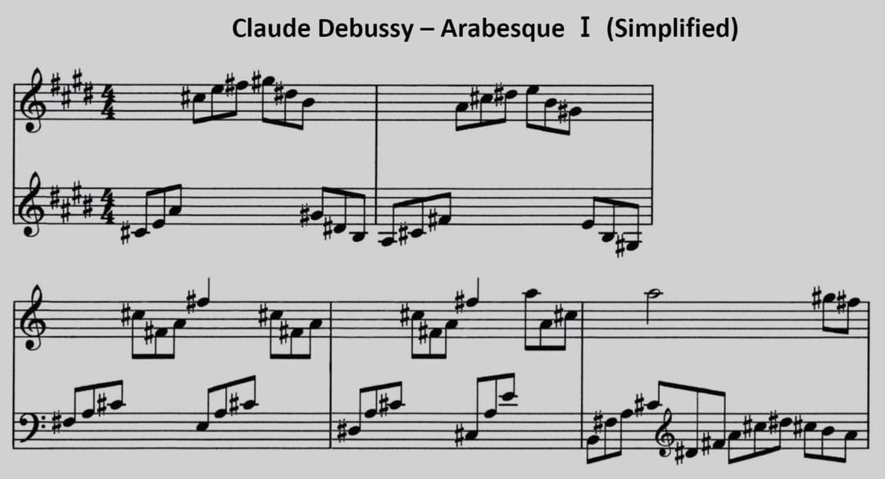

Debussy Arabesque Ⅰ
===================

*JJ van Zon, 2022*

[back](..)

Sheet Music Simplified
----------------------

### Introduction

Visually simpler. Accidentals always placed near notes, even when part of the key.

### Preview

### Contents

- [Debussy Arabesque Ⅰ Sheet Music Simplified (PDF)](debussy-arabesque-1-sheet-music-simplified.pdf)
- [Debussy Arabesque Ⅰ Sheet Music Simplified (docx)](debussy-arabesque-1-sheet-music-simplified.docx)
- [Debussy Arabesque Ⅰ Sheet Music Simplified Page 1 (png)](debussy-arabesque-1-sheet-music-simplified-page-1.png)
- [Debussy Arabesque Ⅰ Sheet Music Simplified Page 2 (png)](debussy-arabesque-1-sheet-music-simplified-page-2.png)
- [Debussy Arabesque Ⅰ Sheet Music Simplified Page 3 (png)](debussy-arabesque-1-sheet-music-simplified-page-3.png)
- [Debussy Arabesque Ⅰ Sheet Music Simplified Page 4 (png)](debussy-arabesque-1-sheet-music-simplified-page-4.png)
- [Debussy Arabesque Ⅰ Sheet Music Simplified Page 5 (png)](debussy-arabesque-1-sheet-music-simplified-page-5.png)
- [Debussy Arabesque Ⅰ Sheet Music Simplified Preview](debussy-arabesque-1-sheet-music-simplified-preview.jpg)

### Original

Derived from:  
[Michael Kravchuk - Free Piano Sheet Music – First Arabesque – Debussy](https://michaelkravchuk.com/free-piano-sheet-music-first-arabesque-debussy/)