Piano Playing Docs | Methods
============================

*JJ van Zon, 2021*

Piano Motion Notation
---------------------

### Introduction

This is an idea for a notation for that might extend fingering from just numbers to additional symbols, indicating how the hands and body might move.

Piano playing may involve:  

- move, press, stretch, turn or stationary
- fingers, wrist, arm and torso  
- in x, y or z directions.

Not all body parts or possible motions seem equally involved.

The symbols aim to be a quite literal representation of body and motion, while still schematic and hopefully not too ambiguous.

Depicting things in 3 dimensions, the symbols may be like looking down at the hands in a sort of perspective projection. To represent depth, diagonal lines might be used.

< Picture >

Rotational directions may then be represented something like this:

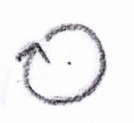

### General

These general moves may involve both fingers and wrist.

| Symbol                                                     | Name               | Description
|:----------------------------------------------------------:|--------------------|---------------------
|  | Reach sideways     | Reach sideways, let go, move hand back.
|   | ''                 | ''
|      | Stretch sideways   | Stretching fingers wider. But trying to release soon.
| 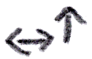    | Stretch diagonally | ''
|       | Reach black keys   | Might prefer crossing over instead.
| 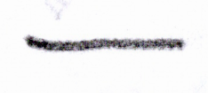       | Resting on keys    |
| 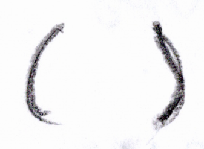           | Slightly           | Moving as indicated between braces, but more slightly.

### Jumps

| Symbol                                                                 | Name                              | Description
|:----------------------------------------------------------------------:|-----------------------------------|-------------------
|                   | Hand upward (left)                |
|                  | Hand upward (right)               |
|                | Gravity assist (left)             | Falling into key with gravity.
|               | Gravity assist (right)            | Falling into key with gravity.
|                | Bowy jump (sideways)              |
| 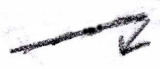                   | Controlled jump (sideways)        | Though grace might desire a bowy move, a jump may be rather big, and might need some control, so perhaps move towards first, then press.
|  | Fall in and then raise out of key | Special case for demonstration.

### Crossing Over

The move may feel semi-smooth.

| Symbol                                                                                       | Name   
|:--------------------------------------------------------------------------------------------:|--------
|                                         | Cross over (large)
|                                         | Cross over (small)
|                  | Cross over (thumb under finger / left hand)
|                   | Cross over (finger over thumb / left hand)
| 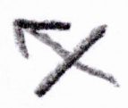                 | Cross over (finger over thumb / right hand)
|                 | Cross over (thumb under finger / right hand)
|       | Cross over / wrist turn (thumb under finger / left hand)
|        | Cross over / wrist turn (finger over thumb / left hand)
|      | Cross over / wrist turn (thumb under finger / right hand)
|       | Cross over / wrist turn (finger over thumb / right hand)

### Fingers

| Symbol                                                            | Name                             | Description
|:-----------------------------------------------------------------:|----------------------------------|-------------------
|                 | Switch finger                    | At different times same key with different fingers.
|        | Switch finger (in place)         | Notation exists in fingering notation. Example: 1｜5 
|                | 3 fingers (flat)                 |
| 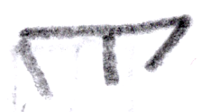         | 3 fingers (pronounced)           |
|  | 3 fingers (curved / variation 1) |
|  | 3 fingers (curved / variation 2) |
|         | 3 fingers (alternative)          |

### Wrist

| Symbol                                                             | Name   
|:------------------------------------------------------------------:|--------
|                          | Wrist
|              | Wrist (alternative)
|                   | Wrist curved (= wrist relief?)
|                     | Wrist high
|                     | Wrist flat (= controlled wrist = finger relief)
|                   | Wrist tilted
|               | Wrist move (right)
|                | Wrist move (left)
|  | Wrist move (towards white keys)
| 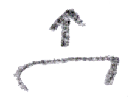 | Wrist move (towards black keys)
|                    | Wrist pivot
|               | Wrist pivot (left)
| 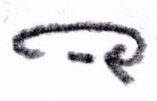             | Wrist pivot (right)
| 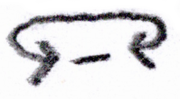    | Wrist pivot (left and right)
|            | Wrist flapping (left)
|           | Wrist flapping (right)
|                 | Wrist circling

### Torso

| Symbol                                                     | Name   
|:----------------------------------------------------------:|--------
|        | Torso (+ arms)
|       | Torso sway (right)
|        | Torso sway (left)
|     | Torso tilt forward
|    | Torso tilt backward
|  | Torso pivot sideways (back and legs)

### Arm Placement

| Symbol                                                                        | Name   
|:-----------------------------------------------------------------------------:|--------
|                          | Arm outward (left)
|                           | Arm inward (left)
|  | Arm placing torso in front of right hand

### Elbow

| Symbol                                                   | Name   
|:--------------------------------------------------------:|--------
|  | Elbow sideways

### Some Fingers Deeper In Keys

| Symbol                                                                                         | Name   
|:----------------------------------------------------------------------------------------------:|--------
| 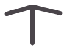                  | 3 fingers (flat / mid finger deeper in keys)
|             | 3 fingers (pronounced / mid finger deeper in keys)
|     | 3 fingers (curved / mid finger deeper in keys / variation 1)
|     | 3 fingers (curved / mid finger deeper in keys / variation 2)
| 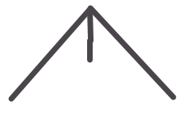               | 3 fingers (flat / outer fingers deeper in keys)
|          | 3 fingers (pronounced / outer fingers deeper in keys)
|  | 3 fingers (curved / outer finger deeper in keys / variation 1)
|  | 3 fingers (curved / outer finger deeper in keys / variation 2)
|                 | 3 fingers (flat / right finger deeper in keys)
| 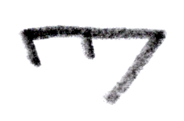          | 3 fingers (pronounced / right finger deeper in keys)
|   | 3 fingers (curved / right finger deeper in keys / variation 1)
|   | 3 fingers (curved / right finger deeper in keys / variation 2)
|                | 4 fingers (flat / outer fingers deeper in keys)
|  | 4 fingers (curved / outer fingers deeper in keys / variation 1)
|  | 4 fingers (curved / outer fingers deeper in keys / variation 2)