Piano Motion Symbols
--------------------

#### Lower Arm Position

The *upper* arm is assumed to be hanging downward.

##### Lower Arm 1D Directions

| |   | |   |
|-|:-:|-|:-:|
| Forward | 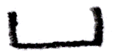 | | |
| Up |   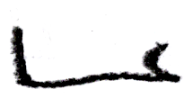 | Down |    |
| In |    | Out | 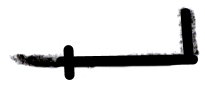    |

##### Lower Arm 2D-Diagonals

| |   | |   |
|-|:-:|-|:-:|
| Forward-up | 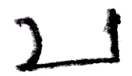 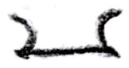  | Forward-down | 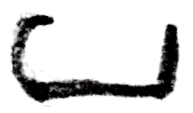 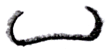 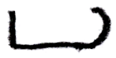 | 
| Forward-in |  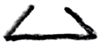 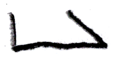 | Forward-out |  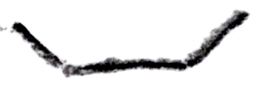 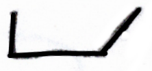 |
| Up-out |    | Down-out | 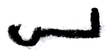  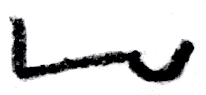 |
| Up-in |    | Down-in | 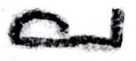 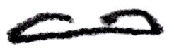  |

##### Lower Arm 3D-Diagonals

| |   | |   |
|-|:-:|-|:-:|
| Forward-up-in | 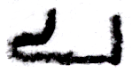 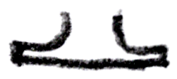  | Forward-up-out | 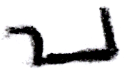   |
| Forward-down-in |   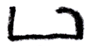 | Forward-down-out |   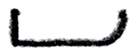 |

##### Lower Arm Backward

| |   | |   |
|-|:-:|-|:-:|
| Backward |   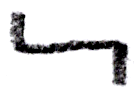 | | |
| Backward-out |  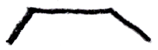  | Backward-in |    |
| Backward-down |  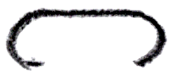 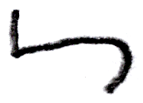 | Backward-up |    |
| Backward-down-out |    | Backward-down-in |    |
| Backward-up-out |  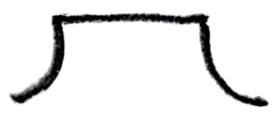  | Backward-up-in | 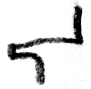 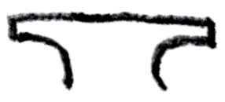  |
