Piano Playing Docs | Methods
============================

*JJ van Zon, 2021*

Piano Motion Symbols
--------------------

### Introduction

This is an idea for a notation for that might extend fingering notation from just numbers to additional symbols, indicating how the hands and body might move.

Piano playing may involve:  

- move, press, stretch, turn or stationary
- fingers, wrist, arm and torso  
- in x, y or z directions.

Not all body parts or motions seem equally involved.

The symbols aim to be a quite literal representation of body and motion, while still schematic and hopefully not ambiguous.

Basic elements might be:

|                                                           |              |                                                  |            |                                                  |                           |
|-----------------------------------------------------------|--------------|--------------------------------------------------|------------|--------------------------------------------------|---------------------------|
| 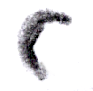 | Finger       | 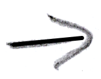   | Move       | 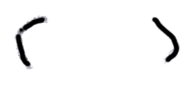       | Loose                     |
| 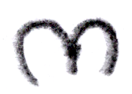     | Fingers      |   | Rotate     | 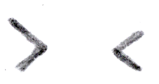       | Tight                     |
| 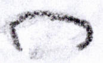         | Wrist        | 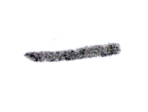  | Stationary | 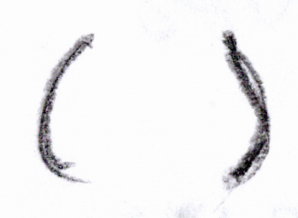 | Slightly (between braces) |
| 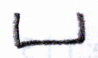      | Torso / arms | 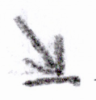       | Press      |                                                  |                           |

Depicting things in 3 dimensions, the symbols may be like looking down at the hands in a sort of perspective projection. To represent depth, diagonal lines might be used. Here is how some things might work in 3 dimensions:

|                                                           |                     |                                                 |            |
|:---------------------------------------------------------:|---------------------|:-----------------------------------------------:|------------|
| 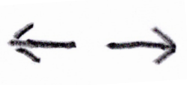      | Move left / right   | 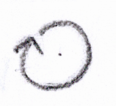 | Rotate X-Y |
|          | Move up / down      |  | Rotate Y-Z |
| 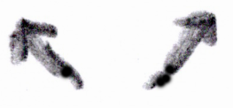     | Move toward face    | 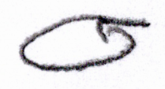 | Rotate X-Z |
| 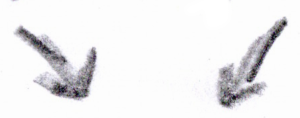  | Move away from face |                                                 |            |

### Tension & Release

|                                                               |                          |                                                         |
|:-------------------------------------------------------------:|--------------------------|:-------------------------------------------------------:|
| 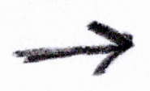    | Reach sideways           | Then let go, move hand back.                            |
| 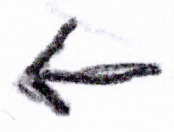     | Reach sideways           | Then let go, move hand back.                            |
| 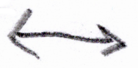        | Stretch sideways         | Stretching fingers wider. But trying to release soon.   |
| 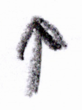         | Reach black keys         | If arpeggiated, might prefer crossing over instead.     |
| 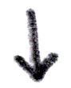         | Reach white keys         | If arpeggiated, might prefer crossing over instead.     |
| 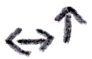       | Stretch diagonally       | Composite of stretch sideways and reach for black keys. |
| 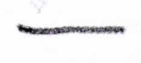          | Resting on keys          |                                                         |
| 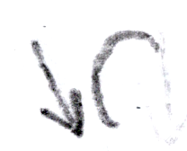    | Finger move into keys    | Motion coming out of the fingers.                       |
| 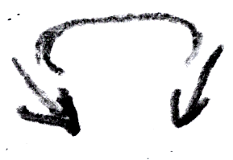     | Wrist move into keys     | Motion coming out of the wrist.                         |
| 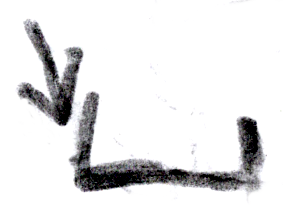       | Arm move into key        | Motion coming out of the arm.                           |
| 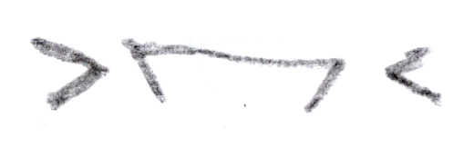   | Pronounced wrist tight   |                                                         |
| 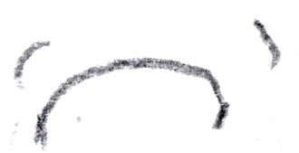       | Curved wrist loose       |                                                         |
| 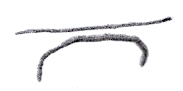  | Curved wrist stationary  |                                                         |
| 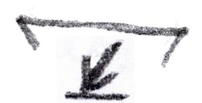 | Pronounced wrist pressed |                                                         |

### Jumps

|                                                                        |                                   |                                 |
|:----------------------------------------------------------------------:|-----------------------------------|---------------------------------|
|                   | Hand upward (left)                |                                 |
| 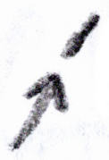                 | Hand upward (right)               |                                 |
| 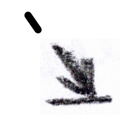               | Gravity assist (left)             | Falling into key with gravity.  |
| 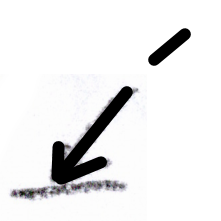              | Gravity assist (right)            | Falling into key with gravity.  |
| 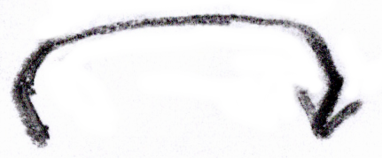               | Bowy jump (sideways)              |                                 |
| 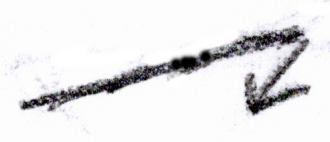                   | Controlled jump (sideways)        | Though grace might desire a bowy move, a jump may be rather big, and might need some control, so perhaps move towards first, then press. |

### Cross Over

May feel semi-smooth.

|                                                       |                    |                                                                               |                                |                                                                                          |                                                   |
|:-----------------------------------------------------:|--------------------|:-----------------------------------------------------------------------------:|--------------------------------|:----------------------------------------------------------------------------------------:|---------------------------------------------------|
| 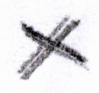 | Cross over (large) | 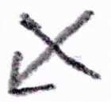  | Thumb under finger / left hand | 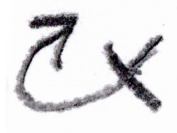  | With wrist turn (thumb under finger / left hand)  |
| 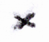 | Cross over (small) | 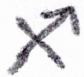   | Finger over thumb / left hand  | 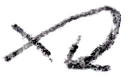   | With wrist turn (finger over thumb / left hand)   |
|                                                       |                    | 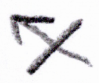  | Finger over thumb / right hand | 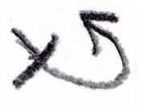 | With wrist turn (thumb under finger / right hand) |
|                                                       |                    | 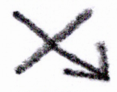 | Thumb under finger / right hand| 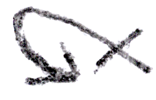  | With wrist turn (finger over thumb / right hand)  |

### Fingers

|               | Flat Fingers                                             | Pronounced Fingers                                        | Curved Fingers                                             |
|---------------|:--------------------------------------------------------:|:---------------------------------------------------------:|:----------------------------------------------------------:|
| __1 Finger__  | 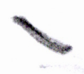  |                                                           |   |
| __1 Finger__  | 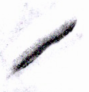 | 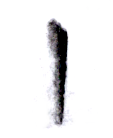  | 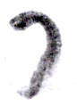 |
| __2 Fingers__ | 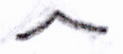      | 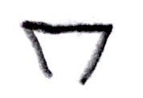 |       |
| __3 Fingers__ |       |  |       |
| __4 Fingers__ |       |  |       |
| __5 Fingers__ |       |  |       |

|                                                                       |                                    |                                                     |
|:---------------------------------------------------------------------:|------------------------------------|-----------------------------------------------------|
|            | Switch finger (in place)           | Part of existing fingering notation.                |
|  | Switch finger (at different times) | At different times same key with different fingers. |

### Wrist

|                                                                |                       |                                                              |                     |                                                                    |                           |                                                                    |                           |
|:--------------------------------------------------------------:|-----------------------|:------------------------------------------------------------:|---------------------|:------------------------------------------------------------------:|---------------------------|:------------------------------------------------------------------:|---------------------------|
|         | With flat fingers     |         | Pronounced          |                   | Curved                    |                     | High                      |
|  | Tilted (flat fingers) |  | Tilted (pronounced) |            | Tilted (curved)           |              | Tilted (high)             |
|           | Move (right)          |          | Move (left)         |  | Move (towards white keys) |  | Move (towards black keys) |
|                | Pivot                 |         | Pivot (left)        |              | Pivot (right)             |     | Pivot (left and right)    |
|        | Flapping (left)       |     | Flapping (right)    |                 | Rotation                  |                                                                    |                           |

### Torso

|                                                            |                                      |
|:----------------------------------------------------------:|--------------------------------------|
|        | Torso (+ arms)                       |
|       | Torso sway (right)                   |
|        | Torso sway (left)                    |
|     | Torso tilt forward                   |
|    | Torso tilt backward                  |
|  | Torso pivot sideways (back and legs) |

### Arm

|                                                                               |                                                  |
|:-----------------------------------------------------------------------------:|--------------------------------------------------|
|                          | Arm outward (left)                               |
|                           | Arm inward (left)                                |
|  | Arm placing torso in front of right hand         |

### Elbow

|                                                          |                |
|:--------------------------------------------------------:|----------------|
|  | Elbow sideways |

### Some Fingers Deeper In Keys

3 fingers:

|                   | Flat Fingers                                                                     | Pronounced Fingers                                                                     | Curved Fingers                                                                     |
|-------------------|:--------------------------------------------------------------------------------:|:--------------------------------------------------------------------------------------:|:----------------------------------------------------------------------------------:|
| __Mid finger__    |     |     |     |
| __Outer fingers__ |  |  |  |
| __Right finger__  |   |   |   |

4 fingers:

|                                                                                        |                                       |
|:--------------------------------------------------------------------------------------:|---------------------------------------|
|        | Flat / outer fingers deeper in keys   |
|      | Curved / outer fingers deeper in keys |
|         | Curved / 3rd finger deeper in keys    |

### Composites

To demonstrate some possibilities for flexibility.

|                                                                                         |                                           |
|-----------------------------------------------------------------------------------------|-------------------------------------------|
|         | Fall in and then raise out of key         |
|          | 3 fingers: flat, pronounced and curved    |
|  | Curved wrist flapping, mid finger pressed |
|               | Curved wrist hopping. 1st and last note pressed. Middle note moved towards black keys, pressed with 3rd finger. |
