Piano Playing Docs | Methods
============================

`[ Draft ]`

*JJ van Zon, 2021*

Piano Motion Symbols
--------------------

### Introduction

This is an idea for a notation for that might extend fingering notation from just numbers to additional symbols, indicating how the hands and body might move.

I hope this might help create awareness of the body and help with piano technique.

Piano playing may involve:  

- position, move, spread, turn, press, stress or hold stationary
- fingers, wrist, arms, torso and seating
- in x, y or z directions.

Not all body parts or motions seem equally involved.

These symbols aim to be a quite literal representation of body and motion, while still schematic and hopefully not ambiguous.

### Basic Elements

These might be some of the basic elements used in this proposed notation. Combinations of basic elements may form specific meaning.

| | | | | | |
|-|-|-|-|-|-|
|  | Finger |  | Move | 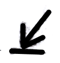 | Press |
|  | Fingers |  | Spread |  | Loose |
|  | Wrist |  | Turn |  | Tight |
|  | Torso / arms |  | Stationary |  | Slightly (braces) |

#### Three Dimensions

Depicting things in 3 dimensions, the symbols may be like looking down at the hands in a sort of perspective projection. To represent depth, diagonal lines might be used. Here is how some things might work in 3 dimensions:

|   | |   | |
|:-:|-|:-:|-|
|  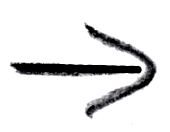 | Move left / right |  | Turn right & left / looking down |
|   | Move forward / backward |  | Turn forward / backward |
|   | Move down |  | Turn right & left / looking forward |
|   | Move up | | |

Diagonal lines might not be a hard rule. Sometimes diagonal lines just mean diagonal lines, instead of the depth dimension.

#### Up / Down With Curled Lines

Diagonal directions seem to matter for arm positions. In that case diagonal lines might not be available for up/down directions. Instead bent lines might be used for up and down. It may represent the curve, that the arm appears to have in those positions.

|   | |
|:-:|-|
|  | Up = curled out |
|  | Down = curled in |
|  | Small curl = 1D direction (up / down) |
|  | ½ curl = 2D diagonal (forward-up) |
|  | ¼ curl = 3D diagonal (forward-up-out) |

#### Turning

Here are several variations on how turning motions might be depicted in 3 dimensions.

| | | | | | |
|-|-|-|-|-|-|
| Turn right (looking down) |  |  |  |  |
| Turn left (looking down) |  |  |  |  |
| Turn right (looking forward) |  |  |  |  |
| Turn left (looking forward) |  |  |  |  | 
| Turn left / right (looking forward) |  |  |  |
| Turn forward |   |   |   |
| Turn backward |   |   |   |
| Turn forward / backward |    |    |

#### Turning Arc

To express a partial turning motion (instead of a full rotation), an arrow might be used. Some parts of the body might not be capable of a full turn.

         

The beginning of the arrow might be denoted with a dash.

#### Nuance

Nuance, like press *a little* or move *a lot*, may be written down like this:

|                 | Restfully | Slightly | Normally | Exaggerated |
|----------------:|:---------:|:--------:|:--------:|:-----------:|
|       __Press__ |  |  |  |  |
|        __Move__ | 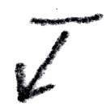 |  |  |  |
| __Tight Wrist__ |  |  | 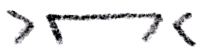 |  |
| __Loose Wrist__ |  |  |  |  |

### Cross Over

Thumbs and fingers might cross over each other. This may be one of the basic techniques in piano playing. Different ways of crossing over may be depicted:

| | | | | | |
|:-:|-|:-:|-|:-:|-|
|  | Cross over (large) |  | Thumb under finger / right hand |  | With wrist turn (thumb under finger / right hand) |
|  | Cross over (small) |  | Finger over thumb / right hand |  | With wrist turn (finger over thumb / right hand) |
| | |  | Thumb under finger / left hand |  | With wrist turn (thumb under finger / left hand) |
| | |  | Finger over thumb / left hand |  | With wrist turn (finger over thumb / left hand) |

### Fingers

#### Finger Position

The hand may be placed with loosely curled fingers. Sometimes curling of the fingers might be more pronounced, perhaps for additional control. Fingers may also be placed flatter on the keys. These following table shows different ways of drawing out these things:

| | Curved / High Fingers | Pronounced Fingers | Flat Fingers (Upward) | Flat Fingers (Downward) |
|-|:-:|:-:|:-:|:-:|
| __1 Finger (Left)__ |  |  |  |  |
| __1 Finger (Right)__ | |  |  |  |
| __2 Fingers__ |  |  |  |  |
| __3 Fingers__ |  |  |  |  |
| __4 Fingers__ |  |  | 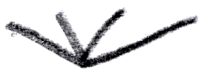 |  |
| __5 Fingers__ |  |  |  | 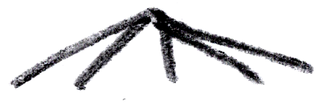 |

#### Fingers Stationary

To express holding fingers stationary, lines might be placed above or below a finger symbol, or at the sides or top or bottom. A perspective effect is attempted to be used to distinguish these.

| | Curved / High Fingers | Pronounced Fingers | Flat Fingers | Finger Numbers |
|-|:-:|:-:|:-:|:-:|
| Fingers Stationary (left / right / 1 finger) |  |  |  | 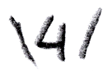 |
| Fingers Stationary (left / right / 3 fingers) |  | 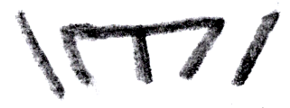 |  | |
| Fingers Stationary (up / down / 1 finger) |  |  |  |  |
| Fingers Stationary (up / down / 3 fingers) |  |  |  | |
| Fingers Stationary (forward / backward / 1 finger) |  |  |  |  |
| Fingers Stationary (forward / backward / 3 fingers) |  |  |  | |

#### Finger Move

Here is an attempt to depict multiple ways of drawing out moving motions for fingers. An *arrow* may be placed near a finger number, or finger symbol. Also might be demonstrated, examples with arrows when displaying *multiple* fingers. For the *depth* direction, *diagonal* arrows might be used to depict a certain perspective projection.

##### Finger Move (Right)

|   |   |   |   |   |   |   |   |
|:-:|:-:|:-:|:-:|:-:|:-:|:-:|:-:|
|  |  |  |  |  |  |  | 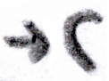 |
|  |  |  |  |  |  |  |  |

##### Finger Move (Left)

|   |   |   |   |   |   |   |   |
|:-:|:-:|:-:|:-:|:-:|:-:|:-:|:-:|
|  |  |  |  | | 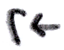 |  |  |
| 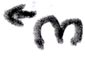 |  |  | |  |  |  |  |

##### Finger Move (Right / Left)

|   |   |   |   |   |   |   |   |
|:-:|:-:|:-:|:-:|:-:|:-:|:-:|:-:|
|  |  |  |  |  |  |  |  |  |  |
|  |  |  |  |  |  | |  |

##### Finger Move (Forward)

|   |   |   |   |   |   |   |   |
|:-:|:-:|:-:|:-:|:-:|:-:|:-:|:-:|
|  |  |  |  | |  |  |  |
|  |  |  |  |  |  |  |  |

##### Finger Move (Backward)

|   |   |   |   |   |   |   |   |
|:-:|:-:|:-:|:-:|:-:|:-:|:-:|:-:|
|  |  |  |  |  |  |  |  |
|  |  |  |  |  |  |  |  |

##### Finger Move (Forward / Backward)

|   |   |   |   |   |   |   |   |
|:-:|:-:|:-:|:-:|:-:|:-:|:-:|:-:|
|  |  |  |  |  |  |  |  |  |  |
|  |  |  |  |  |  |  |  |  |  |  |

##### Finger Move (Down)

|   |   |   |   |   |   |   |   |   |   |
|:-:|:-:|:-:|:-:|:-:|:-:|:-:|:-:|:-:|:-:|
|  |  |  |  | |  |  |  |
|  |  |  |  | |  |  |  |
|  |  |  |  |  |  |  |  |  |  |

##### Finger Move (Up)

|   |   |   |   |   |   |   |   |   |   |
|:-:|:-:|:-:|:-:|:-:|:-:|:-:|:-:|:-:|:-:|
|  |  |  |  |  |  |  |  |
|  |  |  |  |  |  |  |  |
|  |  |  |  |  |  |  |  |  |  |

##### Finger Move (Up / Down)

|   |   |   |   |   |   |   |   |   |   |
|:-:|:-:|:-:|:-:|:-:|:-:|:-:|:-:|:-:|:-:|
|  |  |  |  |  |  |  |  |  |  | 
|  |  |  |  |  |  |  |  |  |  |
|  |  |  |  |  |  |  |  |  |  |  |  |  |  |

#### Finger Press

For finger pressing an arrow might be used with a *dash* below it, to represent *pressure*. Arrows may be placed in different ways in relation to a finger *number*, finger *symbol* or when displaying *multiple* fingers, arrows may be placed with that.

The direction may usually be *downward*, not likely in other directions. To represent the depth direction, *diagonal* arrows might be.

| | | | | | | | | | |
|:-:|:-:|:-:|:-:|:-:|:-:|:-:|:-:|:-:|:-:|
|  |  |  | 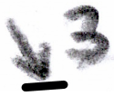 |  |  |  |  |
|  |  |  |  |  |  |  |  |
|  |  |  |  | 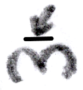 |  |  |  |  |  |

#### Finger Turn

Finger turning may be depicted by a rotation circle with an arrow. It may be placed near a finger *number*, finger *symbol* or when drawing *multiple* fingers.

Finger turning may coincide with finger *moving*,  
but perhaps more of an emphasis on rotational motion.  

##### Finger Turn Details

Finger turning may happen over a *pivotal* point where the finger is attached. The fingers might not make full rotations, but *partial* rotation arcs.

Fingers may pivot over *2* axes:

- Forward up and down
- Sideways facing you (finger wagging)

The *thumb* may pivot over another *3rd* axis (depending on orientation):

- Sideways oriented up and down

Finger wagging may be aided by the friction of the other fingers on the key bed.

##### Finger Turn (Forward)

| | | | | | | | | | |
|:-:|:-:|:-:|:-:|:-:|:-:|:-:|:-:|:-:|:-:|
|  | 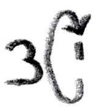 | 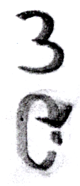 | 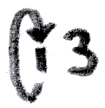 | 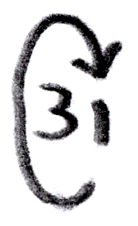 | 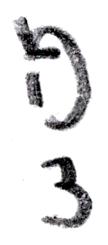 |  |  | 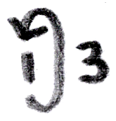 |  |
| 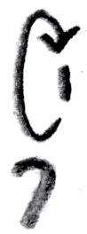 | 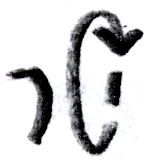 | 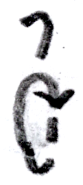 |  | 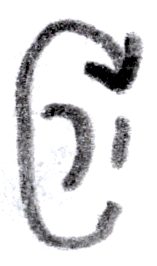 | 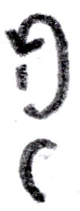 | 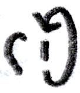 |  | 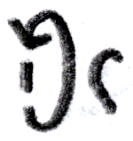 | 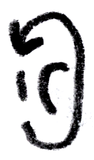 |
| 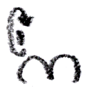 | 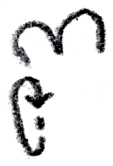 |  |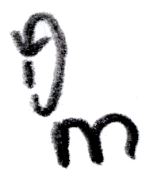 | 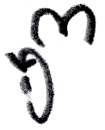 | 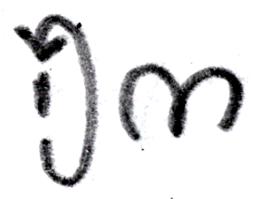 |
| 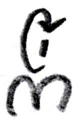 | 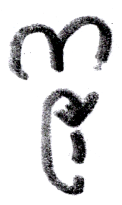 |  |  |
| 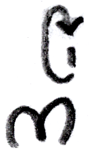 | 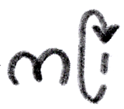 |  | 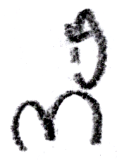 |  | 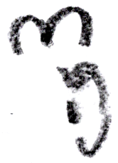 |

##### Finger Turn (Backward)

| | | | | | | | | | |
|:-:|:-:|:-:|:-:|:-:|:-:|:-:|:-:|:-:|:-:|
| 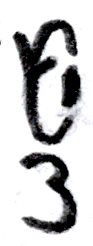 | 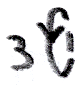 |  |  |  | | 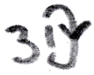 | 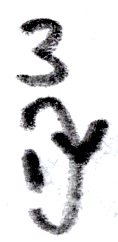 | 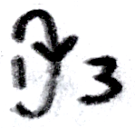 | 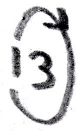 |
|  |  |  |  | 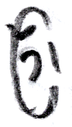 |  |  | 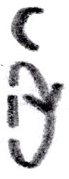 | 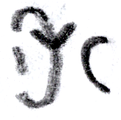 | 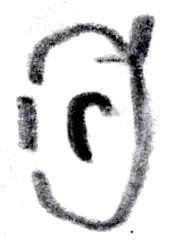 |
|  |  | 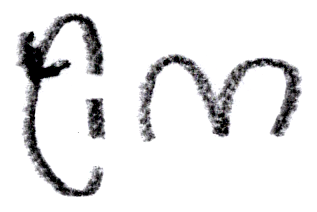 | 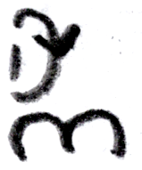 |  |  |
|  |   |  |  |
|  |  |  |  |  |  |

##### Finger Turn (Forward / Backward)

| | | | | | | | | | |
|:-:|:-:|:-:|:-:|:-:|:-:|:-:|:-:|:-:|:-:|
|  |  |  |  |  |  |  |  |  |  |
|  |  |  |  |  |  |  |  |  |  |
|  |  |  |  |  |  |
|  |  |  |  |
|  |  |  |  |  |  |

##### Finger Turn (Right / Looking Down)

| | | | | | | | | | |
|:-:|:-:|:-:|:-:|:-:|:-:|:-:|:-:|:-:|:-:|
|  |  |  |  |  |  |  |  |  |  |
|  |  |  |  |  |  |  |  |

##### Finger Turn (Left / Looking Down)

| | | | | | | | | | |
|:-:|:-:|:-:|:-:|:-:|:-:|:-:|:-:|:-:|:-:|
|  |  |  |  |  |  |  |  |  |  |
|  |  |  |  |  |  |  |  |

##### Finger Turn (Right & Left / Looking Down)

| | | | | | | | | | |
|:-:|:-:|:-:|:-:|:-:|:-:|:-:|:-:|:-:|:-:|
|  |  |  |  |  |  |  |  |  |  |
|  |  |  |  |  |  |  |  |

##### Finger Turn (Right / Looking Forward / Thumb Only)

| | | | | | | | | | |
|:-:|:-:|:-:|:-:|:-:|:-:|:-:|:-:|:-:|:-:|
|  |  |  |  |  |  |  |  |  |  |
|  |  |  |  |  |  |  |  |  |  |
|  |  |  | |  |  |

##### Finger Turn (Left / Looking Forward / Thumb Only)

| | | | | | | | | | |
|:-:|:-:|:-:|:-:|:-:|:-:|:-:|:-:|:-:|:-:|
|  |  |  |  |  |  |  |  |  |  |
|  |  |  |  |  |  |  |  |  |  |
|  |  |  |  |  |  |

##### Finger Turn (Right & Left / Looking Forward / Thumb Only)

| | | | | | | | | | |
|:-:|:-:|:-:|:-:|:-:|:-:|:-:|:-:|:-:|:-:|
|  |  |  |  |  |  |  |  |  |  |
|  |  |  |  |  | |  |  |  |  |
|  |  |  |  |  |  |

#### Finger Spread

Moving fingers wider away from each other stretching. Might be displayed with an arrow going two ways. It may be placed near a finger number, symbol or when displaying multiple fingers.

*Finger spread (with number)*

|   |   |   |   |
|:-:|:-:|:-:|:-:|
|  |  |  |  |

*Finger spread (with symbol)*

|   |   |   |   |
|:-:|:-:|:-:|:-:|
|  |  |  |  |

*Finger spread (between finger numbers)*

|   |
|:-:|
|  |

*Finger spread (3 fingers, left finger)*

|   |   |   |
|:-:|:-:|:-:|
|  |  |  |
|  |  |  |

*Finger spread (3 finger / between left / middle finger)*

|   |   |   |
|:-:|:-:|:-:|
|  |  |  |
|  |  |  |

*Finger spread (3 fingers / between middle / right finger)*

|   |   |   |
|:-:|:-:|:-:|
|  |  |  |
|  |  |  |

*Finger spread (3 fingers / right finger)*

|   |   |   |
|:-:|:-:|:-:|
|  |  |  |

#### Finger Stress

Tense all around, keeping in a fixed position with force. May be displayed with angular *brackets* > < around it to represent *force*. Inversely, keeping it loose may be expressed with *wiggly* symbols ‘ ’. These symbols might be used around finger *numbers*, finger *symbols* or when displaying *multiple* symbols.

| Tight Fingers | Loose Fingers |
|:-------------:|:-------------:|
|  |  |
|  |  |
|  |  |
|  |  |
|   |   |
|    |   |
|   |   |

Composite examples:

 

#### Finger Enunciation

To express how *enunciated* fingers might move, symbols for *nuance* might be used.

| | |
|-|-|
|  | Move fingers restfully |
|  | Move fingers slightly |
|  | Move fingers normally |
|  | Move fingers exaggerated |

#### Finger Switch

|   | | |
|:-:|-|-|
|  | Switch finger (in place) | Part of existing fingering notation. |
|  | Switch finger (at different times) | At different times same key with different fingers. |

### Wrist

#### Wrist Position

The wrist might be positioned in different ways. Closer to the keys with *flatter* fingers, or with wrist placed *higher*, fingers hanging down. These kinds of things may be expressed as follows:

|   | |   | |   | |   | |
|:-:|-|:-:|-|:-:|-|:-:|-|
|  | With flat fingers |  | Pronounced |  | Curved |  | High |
|  | Tilted (flat fingers) |  | Tilted (pronounced) |  | Tilted (curved) |  | Tilted (high) |

#### Wrist Stationary

To express holding the wrist stationary, lines might be placed above or below a wrist symbol, or at the sides or top or bottom. A perspective effect is attempted to be used to distinguish these.

|   | |   | |   | |   | |
|:-:|-|:-:|-|:-:|-|:-:|-|
|  | Stationary (left-right) |  | Stationary (forward / backward) |  | Stationary (up / down) |  | Stationary (composite) |

#### Wrist Move

To express moving the wrist, arrows may be placed near a wrist symbol. For the *depth* direction, *diagonal* arrows might be used to depict a certain perspective projection.

|   | |   | |   | |
|:-:|-|:-:|-|:-:|-|
|  | Wrist move (left) |  | Wrist move (right) |  | Wrist move (right and left) |
|  | |  | |  | |
|  | |  | |  | |
|  | |  | |  | |
|  | Wrist move (down) |  | Wrist move (up / down) |  | Wrist move (up) |
|  | Wrist move (forward) |  | Wrist move (backward) |  | Wrist move (forward / backward) |

These one-sided wrist *moves* may be similar to wrist *turning*:

|   | |   | |   | |
|:-:|-|:-:|-|:-:|-|
|  | Wrist move (down / left side) |  | Wrist move (up / left side) |  | Wrist move (up / down / left side) |
|  | Wrist move (down / right side) |  | Wrist move (up / right side) |  | Wrist move (up / down / right side) |
|  | Wrist move (forward / right side) |  | Wrist move (backward / right side) |  | Wrist move (forward / backward / right side) |
|  | Wrist move (forward / backward / left side) |  | Wrist move (backward / left side) |  | Wrist move (forward / backward / left side) |

A composite picture, to show some flexibility:

| | |
|-|-|
|  | Wrist move (composite) |

#### Wrist Press

May be usually downward, not likely in other directions.

|                                                              |                           |                                                              |                           |
|--------------------------------------------------------------|---------------------------|--------------------------------------------------------------|---------------------------|
|  | Wrist press (variation 1) |  | Wrist press (variation 2) |
|        | Wrist press (right)       |         | Wrist press (left)        |

#### Wrist Turn

| | | | | | |
|-|:-:|:-:|:-:|:-:|:-:|
| Wrist turn (right / looking forward / 'pivot') |  |  |  |  |  |
| Wrist turn (left / looking forward / 'pivot') |  |  |  |  |  |
| wrist turn (right & left / looking forward / 'pivot') |  |  |  |  | 
| wrist turn (right / looking down) |  |  |  |  |  |
| wrist turn (left / looking down) |  |  |  |  |  |
| wrist turn (right & left / looking down) |  |  |  |  |  |
| Wrist turn (forward) / 'flap' |  |  |  |  |  |
| |  |  |  |  |  |
| Wrist turn (backward) / 'flap' |  |  |  |  |  |
| |  |  |  |  |  |
| Wrist turn (forward and backward) / 'flap' |  |  |  |  |  |
| |  |  |  |  |  |

#### Implicit Wrist Turn

Wrist symbols might be optional for wrist turning.

| | | | | | |
|:-:|-|:-:|-|:-:|-|
|  | Implicit wrist turn (right / looking forward / 'pivot') |  | Implicit wrist turn (left / looking forward / 'pivot') |  | Implicit wrist turn (right & left / looking forward / 'pivot') |
|  | Implicit wrist turn (right / looking down) |  | Implicit wrist turn (left / looking down) |  | Implicit wrist turn (right & left / looking down) |
|   | Implicit wrist turn (forward / 'flap') |   | Implicit wrist turn (backward / 'flap') |   | Implicit wrist turn (forward & backward / 'flap') |

#### Wrist Stress

(Combined with wrist positions.)

| | | |
|-|:-:|:-:|
| Wrist tight (flat fingers) |  |  | 
| Wrist loose (flat fingers) |  |  |
| Wrist tight (pronounced) |  |  |
| Wrist loose (pronounced) |  |  |
| Wrist tight (curved) |  |  |
| Wrist loose (curved) |  |  |
| Wrist tight (high) |  |  |
| Wrist loose (high) |  |  |

### Arm

#### Arm Position Suggestions

|   | |
|:-:|-|
|  | Arm position (diagonal in / torso in front of right hand)
|  | Arm position (diagonal in / far reaching)
|  | Arm position (forward / elbow tucked in)
|  | Arm position (rather unusual / upper arm forward, fore arm straight in)
|  | Arm position (rather unusual / upper arm forward, fore arm in / backward)

### Lower Arm

#### Lower Arm Position

The *upper* arm is assumed to be hanging downward.

##### Lower Arm 1D Directions

| |   | |   |
|-|:-:|-|:-:|
| Forward |  | | |
| Up |    | Down |    |
| In |    | Out |     |

##### Lower Arm 2D-Diagonals

| |   | |   |
|-|:-:|-|:-:|
| Forward-up |    | Forward-down |    | 
| Forward-in |    | Forward-out |    |
| Up-out |    | Down-out |    |
| Up-in |    | Down-in |    |

##### Lower Arm 3D-Diagonals

| |   | |   |
|-|:-:|-|:-:|
| Forward-up-in |    | Forward-up-out |    |
| Forward-down-in |    | Forward-down-out |    |

##### Lower Arm Backward

| |   | |   |
|-|:-:|-|:-:|
| Backward |    | | |
| Backward-out |    | Backward-in |    |
| Backward-down |    | Backward-up |    |
| Backward-down-out |    | Backward-down-in |    |
| Backward-up-out |    | Backward-up-in |    |

### Upper Arm

#### Upper Arm Position

##### Upper Arm 1D Directions

|   |   |   |
|:-:|:-:|:-:|
| Upper arm *forward* (lower arm forward) | Upper arm *up* (lower arm up) | Upper arm *down* (lower arm forward) |
|    |    |  |
| Upper arm *in* (lower arm up) | Upper arm *out* (lower arm out) | (lower arm forward) |
|    |    |    |

##### Upper Arm 2D-Diagonals

|   |   |   |
|:-:|:-:|:-:|
| Upper arm *forward-up* (lower arm forward-up) | (lower arm down) | (lower arm down-in) |
|    |    |    |
| Upper arm *forward-down* (lower arm forward-down) | (lower arm forward-up) | 
|    |    |
| Upper arm *forward-in* (lower arm forward-in) | (lower arm in) | 
|    |    |
| Upper arm *forward-out* (lower arm forward) | (lower arm forward-in) |
|    |    |
| Upper arm *up-out* (lower arm up-out) | (lower arm down-out) (difficult, monkey arms) | Upper arm *down-out* (lower arm forward) |
|    |    |    |
| Upper arm *up-in* (lower arm up-in) (over face) | (lower arm in) | Upper arm *down-in* (lower arm forward) |
|    |    |    |

##### Upper Arm 3D-Diagonals

|   |   |   |
|:-:|:-:|:-:|
| Upper arm *forward-up-in* (lower arm forward-up-in) | Upper arm *forward-up-out* (lower arm forward) |
|    |    |
| Upper arm *forward-down-in* (lower arm forward-in) | (lower arm forward-down-in) | Upper arm *forward-down-out* (lower arm forward) |
|    |    |    |

##### Upper Arm Backward

|   |   |   |
|:-:|:-:|:-:|
| Upper arm *backward* (lower arm down) | (lower arm backward) | (lower arm forward) |
|    |    |    |
| Upper arm *backward-out* (lower arm down) | Upper arm *backward-in* (lower arm in / painful perhaps) |
|    |    | 
| Upper arm *backward-down* (lower arm forward) | Upper arm *backward-up* (lower arm down / painful perhaps) |
|    |    |
| Upper arm *backward-down-out* (lower arm forward) | (lower arm down) | Upper arm *backward-down-in* (lower arm down) (quite a stretch) |
|    |    |    | |
| Upper arm *backward-up-out* (lower arm down) (quite a stretch) | Upper arm *backward-up-in* (lower arm backward-up-in) (may be impossible) |
|    |    |

##### Upper Arm Forward + Lower Arm 1D Directions

|   |   |
|:-:|:-:|
| (lower arm forward) | |
|    | |
| (lower arm up) | (lower arm down) (bit painful perhaps) |
|    |    |
| (lower arm in) | (lower arm out) (may be impossible) |
|    |    |

##### Upper Arm Forward + Lower Arm 2D-Diagonals

|   |   |
|:-:|:-:|
| (lower arm forward-up) | (lower arm forward-down) (bit painful perhaps) |
|    |    |
| (lower arm forward-in) | (lower arm forward-out) (bit of a stretch) |
|    |    |
| (lower arm up-out) | (lower arm down-out) (may be impossible) |
|    |    |
| (lower arm up-in) | (lower arm down-in) |
|    |    |

##### Upper Arm Forward + Lower Arm 3D-Diagonals

|   |   |
|:-:|:-:|
| (lower arm forward-up-in) | (lower arm forward-up-out) (bit of a stretch) |
|    |    |
| (lower arm forward-down-in) | (lower arm forward-down-out) (may be impossible) |
|    |    |

##### Upper Arm Forward + Lower Arm Backward

|   |   |
|:-:|:-:|
| (lower arm backward) | |
|    | |
| (lower arm backward-out) (bit of a stretch) | (lower arm backward-in) |
|    |    |
| (lower arm backward-down) | (lower arm backward-up) |
|    |    |
| (lower arm backward-down-out) (may be impossible) | (lower arm backward-down-in) |
|    |    |
| (lower arm backward-up-out) | (lower arm backward-up-in) (may touch your nose) |
|    |    |

### Torso

|                                                           |                                     |
|:---------------------------------------------------------:|-------------------------------------|
|       | Torso (+ arms)                      |
|      | Torso sway (right)                  |
|       | Torso sway (left)                   |
|    | Torso tilt forward                  |
|   | Torso tilt backward                 |
|  | Torso turn sideways (back and legs) |

### Some Fingers Deeper In Keys

3 fingers:

|                                  | Flat Fingers                                                                     | Pronounced Fingers                                                                     | Curved Fingers                                                                     |
|---------------------------------:|:--------------------------------------------------------------------------------:|:--------------------------------------------------------------------------------------:|:----------------------------------------------------------------------------------:|
|    __Mid finger deeper in keys__ |     |     |     |
| __Outer fingers deeper in keys__ |  |  |  |
|  __Right finger deeper in keys__ |   |   |   |

4 fingers:

|                                                                                        |                                       |
|:--------------------------------------------------------------------------------------:|---------------------------------------|
|        | Flat / outer fingers deeper in keys   |
|      | Curved / outer fingers deeper in keys |
|         | Curved / 3rd finger deeper in keys    |

### Tension & Release

| | | |
|:-:|-|-|
|  | Reach sideways | Then let go, move hand back. |
|  | Reach sideways | Then let go, move hand back. |
|  | Spread | Spreading fingers wider. But trying to release soon. |
|  | Reach forward | If arpeggiated, might prefer crossing over instead. |
|  | Reach backward | If arpeggiated, might prefer crossing over instead. |
|  | Spread diagonally | Composite of spread sideways and reach forward. |
|  | Arm press down | Pressure coming out of the arm. |
|  | Hand resting on keys | |
|  | Hand resting on lap | |

### Jumps

|   | | |
|:-:|-|-|
|  | Hand upward (right view) | |
|  | Hand upward (left view) | |
|  | Gravity assist (right view) | Falling down with gravity. |
|  | Gravity assist (left view) | Falling down with gravity. |
|  | Bowy jump (sideways) | |
|  | Controlled jump (sideways) | Though grace might desire a bowy move, a jump may be rather big, and might need some control, so perhaps move toward first, then press. |

### Composite Examples

To demonstrate some possibilities for flexibility.

|                                                                                         |                                           |
|-----------------------------------------------------------------------------------------|-------------------------------------------|
|         | Fall in and then raise out of key         |
|          | 3 fingers: flat, pronounced and curved    |
|  | Curved wrist flapping, mid finger pressed |
|               | Curved wrist hopping. 1st and last note pressed. Middle note moved forward, pressed with 3rd finger. |
