Piano Playing Docs | Methods
============================

*JJ van Zon, 2021*

Piano Motion Symbols
--------------------

### Introduction

This is an idea for a notation for that might extend fingering notation from just numbers to additional symbols, indicating how the hands and body might move.

I hope this might help create awareness of the body and help with piano technique.

Piano playing may involve:  

- position, move, stretch, turn, press, stress or hold stationary
- fingers, wrist, arm and torso  
- in x, y or z directions.

Not all body parts or motions seem equally involved.

These symbols aim to be a quite literal representation of body and motion, while still schematic and hopefully not ambiguous.

### Basic Elements

|                                                            |              |                                                           |            |                                                  |                   |
|------------------------------------------------------------|--------------|-----------------------------------------------------------|------------|--------------------------------------------------|-------------------|
|  | Finger       |  | Move       |  | Press             |
|       | Fingers      |               | Stretch    |        | Loose             |
|           | Wrist        |              | Turn       |        | Tight             |
|        | Torso / arms |            | Stationary |  | Slightly (braces) |

### Three Dimensions

Depicting things in 3 dimensions, the symbols may be like looking down at the hands in a sort of perspective projection. To represent depth, diagonal lines might be used. Here is how some things might work in 3 dimensions:

|                                                                      |                                |                                               |                         |
|:--------------------------------------------------------------------:|--------------------------------|:---------------------------------------------:|-------------------------|
|                  | Move left / right              |  | Turn facing you         |
|  | Move toward black / white keys |  | Turn forward / backward |
|                   | Move into keys                 |  | Turn side to side       |
|                 | Move out of keys               |                                               |                         |

### Nuance

Nuance, like press *a little* or move *a lot*, may be written down like this:

|                 | Restfully                                                  | Slightly                                                  | Normally                                                       | Exaggerated                                                  |
|----------------:|:----------------------------------------------------------:|:---------------------------------------------------------:|:--------------------------------------------------------------:|:------------------------------------------------------------:|
|       __Press__ |        | 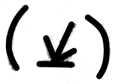       |                |        |
|        __Move__ |         | 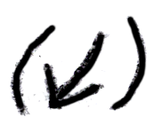        |       |         |
| __Tight Wrist__ |  | 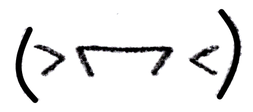 |     |  |
| __Loose Wrist__ | 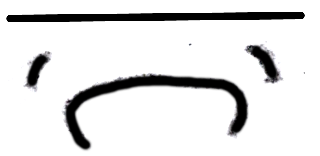 | 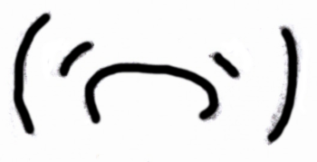 |         |  |

### Tension & Release

|                                                                   |                          |                                                         |
|:-----------------------------------------------------------------:|--------------------------|---------------------------------------------------------|
|         | Reach sideways           | Then let go, move hand back.                            |
|          | Reach sideways           | Then let go, move hand back.                            |
|                       | Stretch                  | Stretching fingers wider. But trying to release soon.   |
|              | Reach black keys         | If arpeggiated, might prefer crossing over instead.     |
|              | Reach white keys         | If arpeggiated, might prefer crossing over instead.     |
|            | Stretch diagonally       | Composite of stretch sideways and reach for black keys. |
|  | Finger move into keys    | Pressure coming out of the fingers.                     |
|     | Arm move into key        | Pressure coming out of the arm.                         |
|          | Hand resting on keys     |                                                         |
|           | Hand resting on lap      |                                                         |

### Jumps

|                                                                        |                                   |                                 |
|:----------------------------------------------------------------------:|-----------------------------------|---------------------------------|
|                  | Hand upward (right)               |                                 |
|                   | Hand upward (left)                |                                 |
|               | Gravity assist (right)            | Falling into key with gravity.  |
|                | Gravity assist (left)             | Falling into key with gravity.  |
|                | Bowy jump (sideways)              |                                 |
|                    | Controlled jump (sideways)        | Though grace might desire a bowy move, a jump may be rather big, and might need some control, so perhaps move toward first, then press. |

### Cross Over

May feel semi-smooth.

|                                                       |                    |                                                                               |                                 |                                                                                          |                                                   |
|:-----------------------------------------------------:|--------------------|:-----------------------------------------------------------------------------:|---------------------------------|:----------------------------------------------------------------------------------------:|---------------------------------------------------|
|  | Cross over (large) |  | Thumb under finger / right hand |  | With wrist turn (thumb under finger / right hand) |
|  | Cross over (small) |   | Finger over thumb / right hand  |   | With wrist turn (finger over thumb / right hand)  |
|                                                       |                    |   | Thumb under finger / left hand  |   | With wrist turn (thumb under finger / left hand)  |
|                                                       |                    |    | Finger over thumb / left hand   |    | With wrist turn (finger over thumb / left hand)   |

### Fingers

This might be used to say something specific about a finger in terms of motion, tension or otherwise.  

#### Finger Position

And different amounts of fingers.

|                      | Flat Fingers                                             | Pronounced Fingers                                              | Curved / High Fingers                                      |
|----------------------|:--------------------------------------------------------:|:---------------------------------------------------------------:|:----------------------------------------------------------:|
| __1 Finger (Right)__ |  |   |  |
| __1 Finger (Left)__  |   | 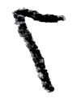   |   |
| __2 Fingers__        |       |        |       |
| __3 Fingers__        |       |        |       |
| __4 Fingers__        |       |        |       |
| __5 Fingers__        |       |        |       |

#### Fingers Stationary

|                                                                    | Flat                                                                                              | Pronounced                                                                                       | Curved / High                                                                               |
|--------------------------------------------------------------------|:-------------------------------------------------------------------------------------------------:|:------------------------------------------------------------------------------------------------:|:-------------------------------------------------------------------------------------------:|
| Fingers Stationary (left / right / finger number)              |                  |                                                                                                  |                                                                                             |
| Fingers Stationary (left / right / 1 finger)                   |                           |                    | 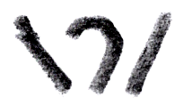                  |
| Fingers Stationary (left / right / 3 fingers)                  | 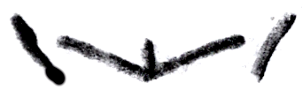                         |                   | 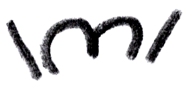                 |
| Fingers Stationary (in / out of keys / finger number)          |           |                                                                                                  |                                                                                             |
| Fingers Stationary (in / out of keys / 1 finger)               |                    |             |            |
| Fingers Stationary (in / out of keys / 3 fingers)              |                   |            |           |
| Fingers Stationary (toward black / white keys / finger number) |  |                                                                                                  |                                                                                             |
| Fingers Stationary (toward black / white keys / 1 finger)      |           |    |   |
| Fingers Stationary (toward black / white keys / 3 fingers)     |          |   |  |

#### Finger Move

| | | | | | |
|---------------------------------------------------|:----------------------------------------------------------------------------------------------------------------:|:---------------------------------------------------------------------------------------------------------------:|:-----------------------------------------------------------------------------------------------------------------:|:-------------------------------------------------------------------------------------------------------------:|:---------------------------------------------------------------------------------------:|
| Finger move (right) |  | 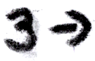 |  |  |
| |  |  |  |  |
| |  | |  |  |
| |  | |  | |
| |  |  |  | |
| Finger move (left) |  |  | 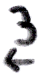 |  |
| |  |  |  |  |
| |  | |  |  |
| |  | |  | |
| |  |  |  | |
| Finger move (right / left) |  |  |  |  |  |
| |  |  |  |  |  |
| |  | |  | 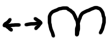 |
| |  | |  | |
| | 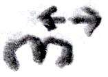 | |  | |
| Finger move (toward black keys) |  |  |  |  |
| |  |  |  |  |
| |  | |  |  |
| |  | |  | |
| |  |  |  | |
| Finger move (toward white keys) |  |  |  |  |
| |  |  |  |  |
| |  | |  |  |
| |  | |  | |
| |  |  |  | |
| Finger move (toward black / white keys) |  |  |  |  |  |
| |  |  |  |  |  |
| |  | |  |  |  |
| |  | |  | |  |
| |  |  |  | |  |
| Finger move (into keys / left view) |  |  |  |  |
| |  |  |  |  |
| |  | |  |  |
| |  | |  | |
| Finger move (into keys / right view) |  |  |  |  |
| |  |  |  |  |
| |  | |  | |
| |  |  |  | |
| Finger move (out of keys / left view) |  |  |  |  |
| |  |  |  |  |
| |  | |  |  |
| |  | |  | |
| | | | | |
| Finger move (out of keys / right view) |  |  |  |  |
| |  |  |  |  |
| |  | |  | |
| |  |  |  | |
| | | | | |
| Finger move (in and out of keys / left view) |  |  |  |  |
| Finger move (in and out of keys / right view) |  |  |  |  |

#### Finger Enunciation

|                                                                                                       |                          |
|-------------------------------------------------------------------------------------------------------|--------------------------|
|                                        | Move fingers restfully   |
|                                         | Move fingers slightly    |
|  | Move fingers normally    |
|                                      | Move fingers exaggerated |

#### Finger Switch

|                                                                       |                                    |                                                     |
|:---------------------------------------------------------------------:|------------------------------------|-----------------------------------------------------|
|            | Switch finger (in place)           | Part of existing fingering notation.                |
|  | Switch finger (at different times) | At different times same key with different fingers. |

### Wrist

#### Wrist Position

|                                                                |                             |                                                              |                                             |                                                                    |                                           |                                                                    |                            |
|:--------------------------------------------------------------:|-----------------------------|:------------------------------------------------------------:|---------------------------------------------|:------------------------------------------------------------------:|-------------------------------------------|:------------------------------------------------------------------:|----------------------------|
|         | With flat fingers           |         | Pronounced                                  |                   | Curved                                    |                     | High                       |
| 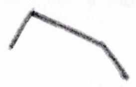 | Tilted (flat fingers)       |  | Tilted (pronounced)                         |            | Tilted (curved)                           |              | Tilted (high)              |

#### Wrist Stationary

|                                                                |                             |                                                              |                                             |                                                         |                                           |                                                                    |                            |
|:--------------------------------------------------------------:|-----------------------------|:------------------------------------------------------------:|---------------------------------------------|:-------------------------------------------------------:|-------------------------------------------|:------------------------------------------------------------------:|----------------------------|
| 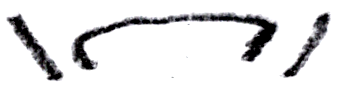        | Stationary (left-right) | 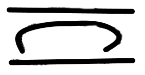      | Stationary (toward black / white keys)  |  | Stationary (in / out of keys)         |           | Stationary (composite) |

#### Wrist Move

|                                                                   |                                     |                                                                    |                                      |                                                                             |                                               |
|:-----------------------------------------------------------------:|-------------------------------------|:------------------------------------------------------------------:|--------------------------------------|:---------------------------------------------------------------------------:|-----------------------------------------------|
|   | Wrist move (left / variation 1) |   | Wrist move (right / variation 1) |   | Wrist move (right and left / variation 1) |
|   | Wrist move (left / variation 2) |   | Wrist move (right / variation 2) |   | Wrist move (right and left / variation 2) |
|          | Wrist move (into keys)          |  | Wrist move (in / out of keys)    |                  | Wrist move (out of keys)                  |
|  | Wrist move (toward black keys)  |   | Wrist move (toward white keys)   |  | Wrist move (toward black and white keys)  |

These wrist *moves* may the same as wrist *turning*:

|                                                                         |                                            |                                                                         |                                            |                                                                                   |                                                      |
|:-----------------------------------------------------------------------:|--------------------------------------------|:-----------------------------------------------------------------------:|--------------------------------------------|:---------------------------------------------------------------------------------:|------------------------------------------------------|
|           | Wrist move (into keys / left)          |         | Wrist move (out of keys / left)        |            | Wrist move (in or out of keys / left)            |
|          | Wrist move (into keys / right)         |        | Wrist move (out of keys / right)       |           | Wrist move (in or out of keys / right)           |
|  | Wrist move (toward black keys / right) |  | Wrist move (toward white keys / right) |  | Wrist move (toward black and white keys / right) |
|   | Wrist move (toward black keys / left)  |   | Wrist move (toward white keys / left)  |   | Wrist move (toward black and white keys / left)  |

A composite, to show some flexibility:

|                                                           |                        |
|-----------------------------------------------------------|------------------------|
|  | Wrist move (composite) |

#### Wrist Press

Is usually downward, not likely in any other direction.

|                                                              |                           |                                                              |                           |
|--------------------------------------------------------------|---------------------------|--------------------------------------------------------------|---------------------------|
| 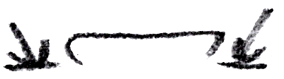 | Wrist press (variation 1) |  | Wrist press (variation 2) |
|        | Wrist press (right)       |         | Wrist press (left)        |

#### Wrist Turn

|                                                                            |                                                    |                                                                            |                                                 |                                                                           |                                          |
|:--------------------------------------------------------------------------:|----------------------------------------------------|:--------------------------------------------------------------------------:|-------------------------------------------------|:-------------------------------------------------------------------------:|------------------------------------------|
|                       | Wrist turn (right) / 'pivot'                       |                        | Wrist turn (left) / 'pivot'                     |             | wrist turn (right and left) / 'pivot'    |
|            | wrist turn (facing you / right)                    |             | wrist turn (facing you / left)                  |  | wrist turn (facing you / right and left) |
|               | Wrist turn (forward / right) / 'flap'              |                | Wrist turn forward (left) / 'flap'              |                                                                           |                                          |
|              | Wrist turn (backward / right) / 'flap'             |               | Wrist turn backward (left) / 'flap'             |                                                                           |                                          |
|  | Wrist turn (forward and backward / right) / 'flap' |   | Wrist turn forward and backward (left) / 'flap' |                                                                           |                                          |

#### Wrist Stress

(Combined with wrist positions.)

|                                                               |                            |                                                               |                            |
|:-------------------------------------------------------------:|----------------------------|:-------------------------------------------------------------:|----------------------------|
|  | Wrist tight (flat fingers) |  | Wrist loose (flat fingers) |
|    | Wrist tight (pronounced)   | 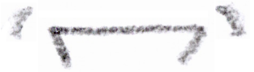   | Wrist loose (pronounced)   |
|        | Wrist tight (curved)       |        | Wrist loose (curved)       |
|          | Wrist tight (high)         |          | Wrist loose (high)         |

### Torso

|                                                           |                                     |
|:---------------------------------------------------------:|-------------------------------------|
|       | Torso (+ arms)                      |
|      | Torso sway (right)                  |
|       | Torso sway (left)                   |
|    | Torso tilt forward                  |
|   | Torso tilt backward                 |
|  | Torso turn sideways (back and legs) |

### Arm

|                                                                               |                                                  |
|:-----------------------------------------------------------------------------:|--------------------------------------------------|
|                          | Arm outward (left)                               |
|                           | Arm inward (left)                                |
|  | Arm placing torso in front of right hand         |

### Elbow

|                                                          |                |
|:--------------------------------------------------------:|----------------|
|  | Elbow sideways |

### Some Fingers Deeper In Keys

3 fingers:

|                                  | Flat Fingers                                                                     | Pronounced Fingers                                                                     | Curved Fingers                                                                     |
|---------------------------------:|:--------------------------------------------------------------------------------:|:--------------------------------------------------------------------------------------:|:----------------------------------------------------------------------------------:|
|    __Mid finger deeper in keys__ |     |     |     |
| __Outer fingers deeper in keys__ |  |  |  |
|  __Right finger deeper in keys__ |   |   |   |

4 fingers:

|                                                                                        |                                       |
|:--------------------------------------------------------------------------------------:|---------------------------------------|
|        | Flat / outer fingers deeper in keys   |
|      | Curved / outer fingers deeper in keys |
|         | Curved / 3rd finger deeper in keys    |

### Composites

To demonstrate some possibilities for flexibility.

|                                                                                         |                                           |
|-----------------------------------------------------------------------------------------|-------------------------------------------|
|         | Fall in and then raise out of key         |
|          | 3 fingers: flat, pronounced and curved    |
|  | Curved wrist flapping, mid finger pressed |
|               | Curved wrist hopping. 1st and last note pressed. Middle note moved toward black keys, pressed with 3rd finger. |
