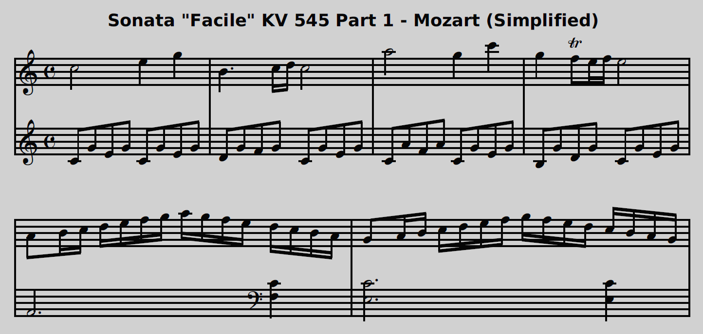

🎵 Mozart - Sonata Facile K. 545 Part 1
========================================

*JJ van Zon, 2022*

[back](../README.md)

Sheet Music Simplified Notation
-------------------------------

### Introduction

Visually simpler. The layout is quite widely spaced. Simplified using the following [guidelines](https://jjvanzon.github.io/Piano-Playing-Docs/methods/sheet-music-simplification.html).

### Preview

### Contents

- [Sheet Music Simplified Notation (PDF)](mozart-sonata-facile-part-1-sheet-music-simplified-notation.pdf)
- <a href="https://musescore.com/user/42589871/scores/7737641" target="_blank" rel="noopener noreferrer">Sheet Music Simplified Notation (MuseScore Web Page)</a>
- [Sheet Music Simplified Notation (MuseScore Uncompressed XML File)](mozart-sonata-facile-part-1-sheet-music-simplified-notation.mscx)
- [Sheet Music Simplified Notation (MuseScore File)](mozart-sonata-facile-part-1-sheet-music-simplified-notation.mscz)

### Original

Derived from [this](https://jjvanzon.github.io/Piano-Playing-Docs/mozart-sonata-facile-part-1/sheet-music/README.html) version.

[back](../README.md)
