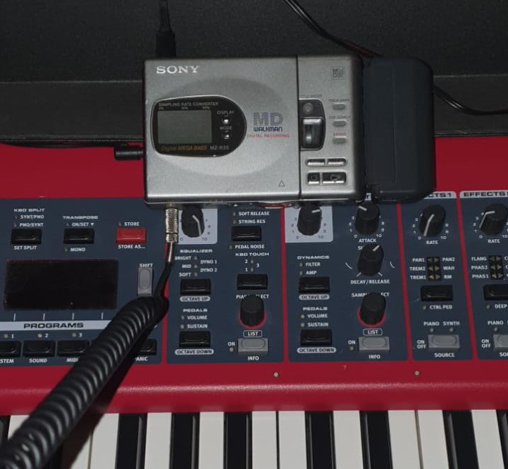

🔊 Recordings
==============

*JJ van Zon, 2022*

    

[back](./README.md)

Recordings of my playing some piano pieces.

[🦉 Erik Satie - Gnossienne Ⅰ](satie-gnossienne-1/README.md)
------------------------------------------------------------

<audio controls>
  <source src="satie-gnossienne-1/recording/satie-gnossienne-1-recording-320-kbps.mp3" type="audio/mpeg">
  Your browser does not support the audio element. <a href="satie-gnossienne-1/recording/satie-gnossienne-1-recording-320-kbps.mp3" download>Download file</a>
</audio>

[💃 Frédéric Chopin - Mazurka Op. 24, No. 2](chopin-mazurka-op-24-no-2/README.md)
---------------------------------------------------------------------------------

<audio controls>
  <source src="chopin-mazurka-op-24-no-2/recording/chopin-mazurka-op-24-no-2-recording-320kbps.mp3" type="audio/mpeg">
  Your browser does not support the audio element. <a href="chopin-mazurka-op-24-no-2/recording/chopin-mazurka-op-24-no-2-recording-320kbps.mp3" download>Download file</a>
</audio>

[🗿 Mozart - Sonata Facile K. 545 Part 1](mozart-sonata-facile-part-1/README.md) [ Practice ]
------------------------------------------------------------------------------------------

<audio controls>
  <source src="mozart-sonata-facile-part-1/recording/mozart-sonata-facile-part-1-2nd-half-recording-320kbps.mp3" type="audio/mpeg">
  Your browser does not support the audio element. <a href="mozart-sonata-facile-part-1/recording/mozart-sonata-facile-part-1-2nd-half-recording-320kbps.mp3" download>Download file</a>
</audio>

[back](./README.md)