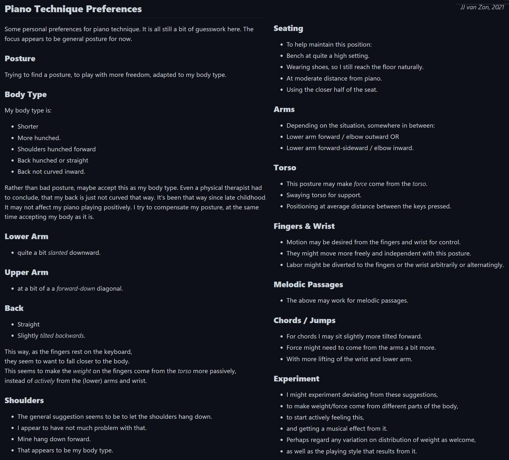

Piano Playing Docs
==================

Resources
---------

- [Unicode Characters for Music](unicode-characters-for-music.md)
- [8th Rest Symbol Picture](8th-rest-symbol.png)
- [Sharp Symbol](sharp-symbol.png)
- [Natural Symbol](natural-symbol.png)

### Previews for Social Media

#### [Preview Piano Motion Symbols, Arm Motion Pictures](preview-piano-motion-symbols-arm-motion-pictures.png)

#### [Preview Practice Schema (Dark)](preview-practice-schema-dark.png)

#### [Preview Piano Motion Symbols Upper Arm Positions](preview-piano-motion-symbols-upper-arm-positions.png)

#### [Preview Finger Numbers, Mozart Sonata Facile KV 545 Part 1](preview-finger-numbers-mozart-sonata-facile-part-1.jpg)

#### [Preview Body Posture](preview-body-posture.png)

#### [Preview Body Posture 2](preview-body-posture-2.png)

#### [Preview Piano Hobby Goals](preview-piano-hobby-goals.png)

