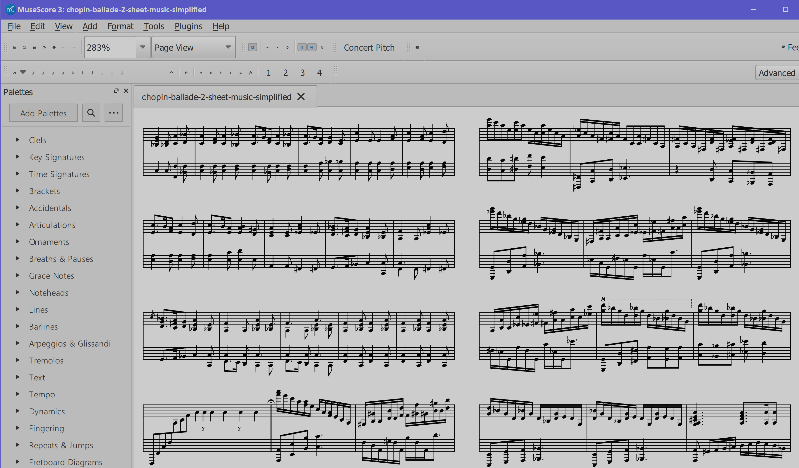

🔧 Resources
=============

*JJ van Zon, 2022*

[back](../README.md)

- [Unicode Characters for Music](unicode-characters-for-music.md)

Elements
--------

### [8th Rest Symbol](8th-rest-symbol.png)

### [End Bar](end-bar.png)

### [Flat Symbol](flat-symbol.png)

### [Flat Symbol (Small)](flat-symbol-small.png)

### [Half Rest Symbol](half-rest-symbol.png)

### [Measure Bar](measure-bar.png)

### [Natural Symbol](natural-symbol.png)

### [Repeat Bar Left](repeat-bar-left.png)

### [Repeat Bar Right](repeat-bar-right.png)

### [Sharp Symbol](sharp-symbol.png)

### [Sharp Symbol (Bigger)](sharp-symbol-bigger.png)

### [Whole Rest Symbol](whole-rest-symbol.png)

Photos / Previews for Social Media
----------------------------------

### [Photo JJ's Piano Laptop Sheet Music Analysis](photo-jjs-piano-laptop-sheet-music-analysis.jpg)

### [Photo JJ's Piano Laptop Sheet Music Analysis Cropped](photo-jjs-piano-laptop-sheet-music-analysis-cropped.jpg)

### [Photo JJ's Piano Laptop Sheet Music Analysis Wide](photo-jjs-piano-laptop-sheet-music-analysis-wide.jpg)

### [Preview Body Posture](preview-body-posture.png)

### [Preview Body Posture 2](preview-body-posture-2.png)

### [Preview Chopin Mazurka Op. 24 No. 2 Sheet Music Simplification Muse Score](preview-chopin-mazurka-op-24-no-2-sheet-music-simplification-muse-score.jpg)

### [Preview Finger Numbers, Mozart Sonata Facile KV 545 Part 1](preview-finger-numbers-mozart-sonata-facile-part-1.jpg)

### [Preview MiniDisk Recorder](preview-mini-disk-recorder.jpeg)

### [Preview MiniDisk Recorder Detail](preview-mini-disk-recorder-detail.jpeg)

### [Preview MuseScore Editing Chopin Ballade Ⅱ](preview-muse-score-editing-chopin-ballade-2.png)

### [Preview Piano Hobby Goals](preview-piano-hobby-goals.png)

### [Preview Piano Motion Symbols, Arm Motion Pictures](preview-piano-motion-symbols-arm-motion-pictures.png)

### [Preview Piano Motion Symbols Upper Arm Positions](preview-piano-motion-symbols-upper-arm-positions.png)

### [Preview Pieces to Play](preview-pieces-to-play.png)

### [Preview Pieces to Play 2](preview-pieces-to-play-2.png)

### [Preview Practice Schema (Dark)](preview-practice-schema-dark.png)

### [Preview Satie Gnossienne 1 Sheet Music Simplification](preview-satie-gnossienne-1-sheet-music-simplification.jpg)

### [Preview Satie Gnossienne 1 Sheet Music Simplification (Detail)](preview-satie-gnossienne-1-sheet-music-simplification-detail.png)

### [Preview Web Site JJ's Piano Playing Docs](preview-web-site-jjs-piano-playing-docs.png)

Misc
----

- [MuseScore Style File from Satie Gymnopédie Ⅰ](muse-score-style-from-satie-gymnopedie-1.mss)
- [MuseScore Style File from Chopin Mazurka Op. 24, No. 2](muse-score-style-from-chopin-mazurka-op-24-no-2.mss)
- [MuseScore Style File from Mozart Sonata Facile KV 545 Part 1](muse-score-style-from-mozart-sonata-facile-part-1.mss)

[back](../README.md)

