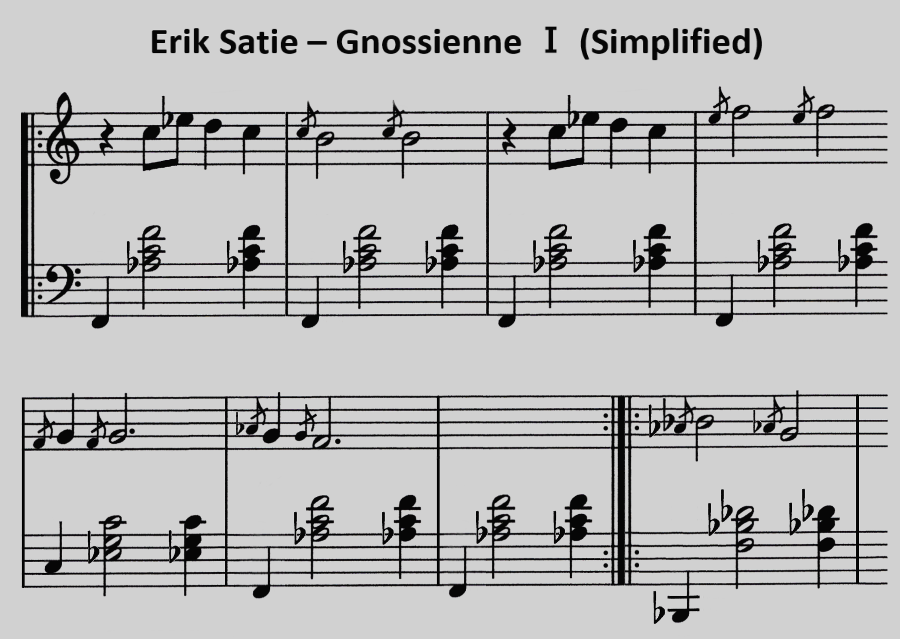

🎵 Erik Satie - Gnossienne Ⅰ
============================

*JJ van Zon, 2022*

[back](../README.md)

Sheet Music with Simplified Notation
------------------------------------

### Introduction

Visually simpler. Simplified using the following [guidelines](https://jjvanzon.github.io/Piano-Playing-Docs/methods/sheet-music-notation-simplification.html).

### Preview

### Download

- [Sheet Music with Simplified Notation (PDF)](satie-gnossienne-1-sheet-music-simplified-notation.pdf)
- [Sheet Music with Simplified Notation (docx)](satie-gnossienne-1-sheet-music-simplified-notation.docx)
- [Sheet Music with Simplified Notation (png)](satie-gnossienne-1-sheet-music-simplified-notation.png)

### Original

Derived from [this](https://jjvanzon.github.io/Piano-Playing-Docs/satie-gnossienne-1/sheet-music/README.html) version.

[back](../README.md)