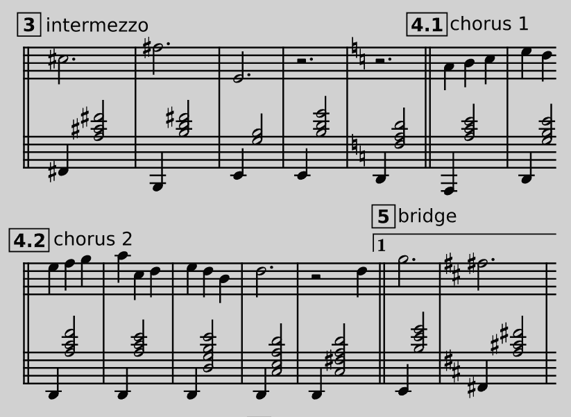

🔢 Erik Satie - Gymnopédie Ⅰ
============================

*JJ van Zon, 2022*

[back](../README.md)

Sheet Music with Rehearsal Marks
--------------------------------

### Introduction

- Visually simpler.  
- Rehearsal marks added (__1, 2, 3, 4.1, 4.2__, etc.)
- Fragments stereotyped (__prefix, verse, chorus__, etc.)
- Simplified using the following [guidelines](https://jjvanzon.github.io/Piano-Playing-Docs/methods/sheet-music-simplification.html).
- Rehearsal marks using the following [guidelines](https://jjvanzon.github.io/Piano-Playing-Docs/methods/fragment-subdivision.html).

### Preview

### Contents

- [Sheet Music with Rehearsal Marks (PDF)](satie-gymnopedie-1-sheet-music-rehearsal-marks.pdf)
- <a href="https://musescore.com/user/42589871/scores/7950098" target="_blank" rel="noopener noreferrer">Sheet Music with Rehearsal Marks (MuseScore Web Page)</a>
- [Sheet Music with Rehearsal Marks (MuseScore File)](satie-gymnopedie-1-sheet-music-rehearsal-marks.mscz)
- [Sheet Music with Rehearsal Marks (MuseScore Uncompressed XML File)](satie-gymnopedie-1-sheet-music-rehearsal-marks.mscx)

### Original

Derived from [this](https://jjvanzon.github.io/Piano-Playing-Docs/satie-gymnopedie-1/sheet-music/README.html) version.

[back](../README.md)