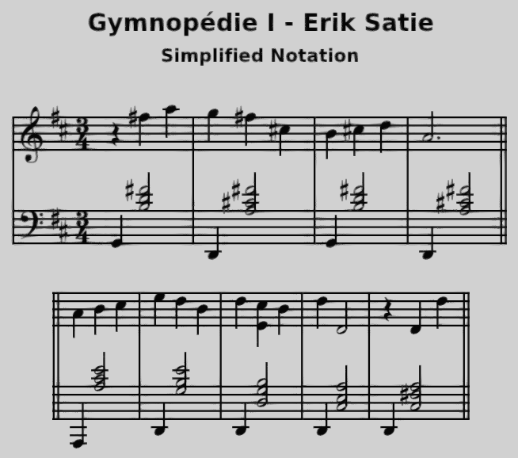

🎶 Erik Satie - Gymnopédie Ⅰ
============================

*JJ van Zon, 2022*

[back](../README.md)

Sheet Music Simplified
----------------------

### Introduction

Visually simpler. Accidentals always placed near notes, even when part of the key.  
Simplified using the following [guidelines](https://jjvanzon.github.io/Piano-Playing-Docs/methods/sheet-music-simplification.html).

### Preview

### Contents

- [Sheet Music Simplified (PDF)](satie-gymnopedie-1-sheet-music-simplified.pdf)
- [Sheet Music Simplified (MuseScore File)](satie-gymnopedie-1-sheet-music-simplified.mscz)
- [Sheet Music Simplified (MuseScore Uncompressed XML File)](satie-gymnopedie-1-sheet-music-simplified.mscx)

### Original

Derived from [this](https://jjvanzon.github.io/Piano-Playing-Docs/satie-gymnopedie-1/sheet-music/README.html) version.

[back](../README.md)